### 一维数组

#### 941 有效的山脉数组

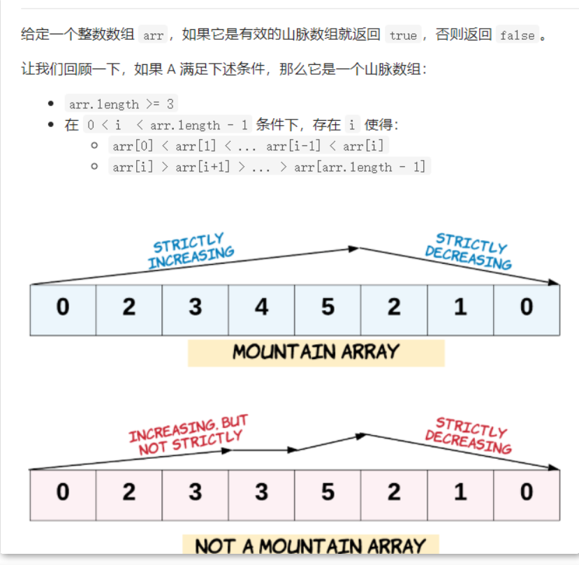

```c#
public static bool ValidMountainArray(int[] arr)
    {
        //两个指针，一个开头一个结尾
        int r = arr.Length ;
        int l = 0;
        //找到最高点 
        while (l < r - 1 && arr[l] < arr[l + 1]) l++;
        //限制边界，最高点不能是第一个和最后一个元素
        if (l == 0 || l == r - 1) return false;
        //从最高点往后递减扫描
        while (l < r - 1 && arr[l] > arr[l + 1]) l++;
        //如果i指向数组最后一个元素，则返回true，否则返回false
        return l == r - 1;
    }
```

#### 189. 轮转数组

##### 1.使用额外数组

(i+k)%n 得到数组元素旋转后的位置 i为元素下标 n为数组长度

```c#
 public static void Rotate(int[] nums, int k)
    {
        int n = nums.Length;
        k = k % n;
        int[] newarr = new int[n];
        for (int i = 0; i < nums.Length; i++)
        {
            int index = (i + k) % n;
            newarr[index] = nums[i];
        }

        // Array.Copy(newarr, 0, nums, 0, n);

        for (int i = 0; i < n; i++)
        {
            nums[i] = newarr[i];
        }
    }
```

##### 2.环装替代

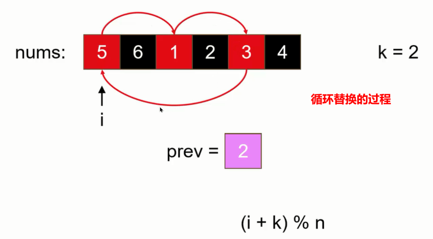

将curr上的元素记在prev上 next指向的上旋转后的元素的位置  next和prev交换，计算完一环后 start++

一直到curr等于start结束

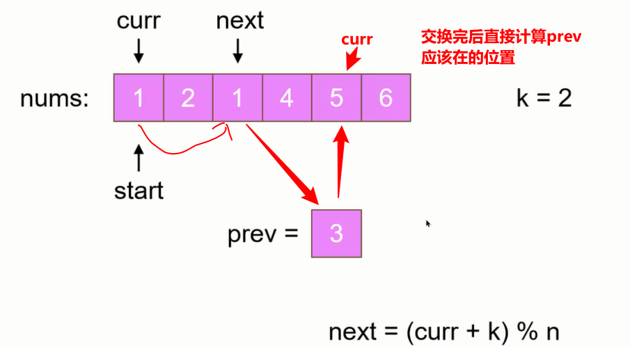

```c#
 public static void Rotate2(int[] nums, int k)
    {
        int n = nums.Length;
        k = k % n;
        //记住替换了多少个
        int count = 0;
        for (int start = 0; count < n; start++)
        {//标记每一次环的起始点
            int curr = start;
            int prev = nums[start];
            do
            {
                int next = (curr + k) % n;
                int tmp = nums[next];
                nums[next] = prev;
                prev = tmp;
                curr = next;
                count++;
            } while (start != curr);
        }
    }
```

##### 3.数组翻转

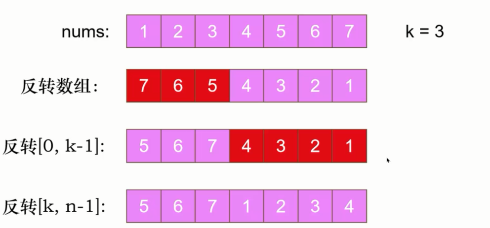 

```c#
public class Solution {
    public void Rotate(int[] nums, int k) {
        int n = nums.Length;
        k = k % n;
        Reverse(nums, 0, n - 1);
        Reverse(nums, 0, k - 1);
        Reverse(nums, k, n - 1);
    }
        //对撞指针
    public static void Reverse(int[] arr, int start, int end)
    {
        while (start<end)
        {
            int tmp = arr[start];
            arr[start] = arr[end];
            arr[end] = tmp;
            start++;
            end--;
        }
    }

}
```

#### 665 非递减数列

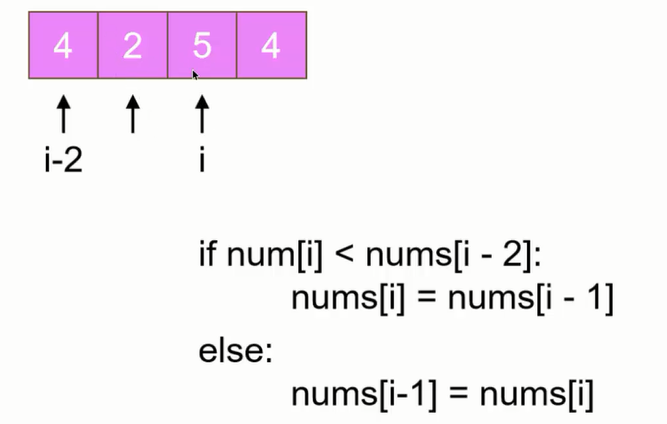

```c#
public bool CheckPossibility(int[] nums)
    {
        int count = 0;
        for (int i = 1; i < nums.Length; i++)
        {
            if (nums[i] < nums[i - 1])
            {
                //只能改一次元素的值，记录一下，多了就是false
                count++;
                if (count > 1) return false;
                //防止数组越界！！！！
                if (i - 2 >= 0 && nums[i] < nums[i - 2])
                {
                    nums[i] = nums[i - 1];
                }
                else
                {
                    nums[i - 1] = nums[i];
                }
            }
        }
        return true;
    }
```

#### 228.汇总区间

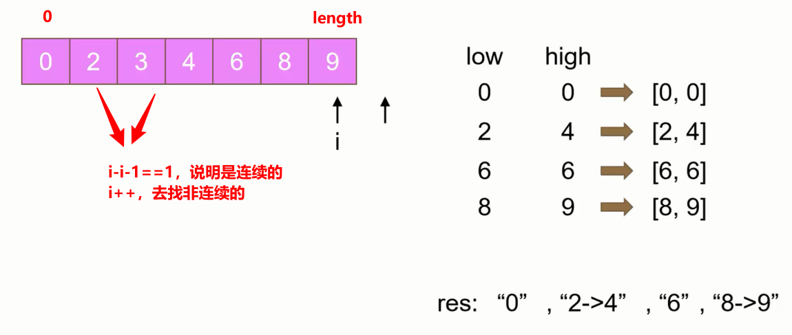


```c#
public IList<string> SummaryRanges(int[] nums)
    {
        List<string> res = new List<string>();
        int i = 0;
        while (i < nums.Length)
        {
            int low = i;
            i++;
            //找到非连续的点
            while (i < nums.Length && nums[i] - nums[i - 1] == 1) i++;
            //上面i++了就要剪掉1，从0开始
            int end = i - 1;
            StringBuilder sb = new StringBuilder(nums[low].ToString());
            if (low < end)
            {
                sb.Append("->");
                sb.Append(nums[end]);
            }

            res.Add(sb.ToString());
        }

        return res;
    }
```

#### 163 缺失的区间

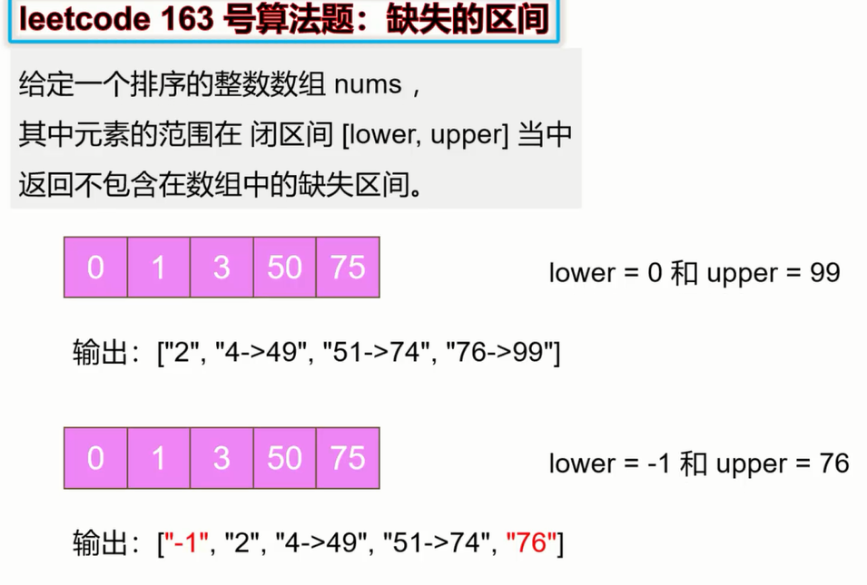

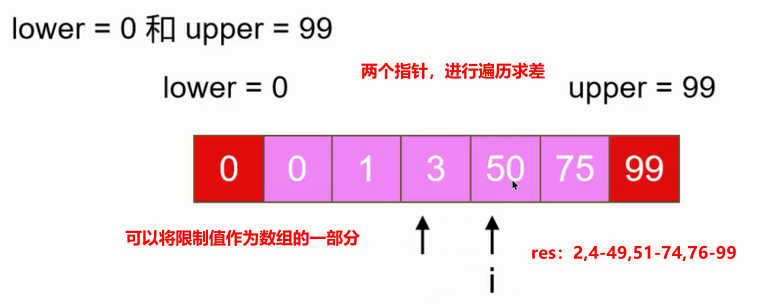

#### 31 下一个排列

​	先找到靠右的较小数 和靠右的比较小数大的较大数 ，将两个数交换，随后翻转剩下的

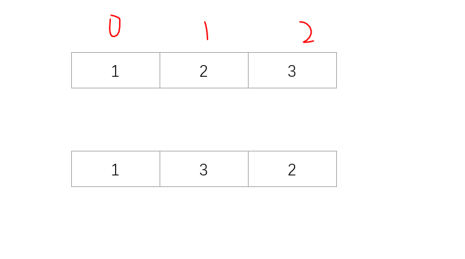

```c#
 public  void NextPermutation(int[] nums)
    {
        int i = nums.Length - 2;

        while (i >= 0 && nums[i] >= nums[i + 1]) i--;

        if (i>=0)
        {
            int j = nums.Length - 1;
            while (j >= 0 && nums[i] >= nums[j]) j--;
            
            Swap(nums,i,j);
        }
        Reverse(nums,i + 1);
    }
     public void Swap(int[]arr,int i,int j)
    {
        int temp = arr[i];
        arr[i] = arr[j];
        arr[j] = temp;
    }

    public void Reverse(int[] arr, int start)
    {
        int left = start;
        int right = arr.Length - 1;
        while (left<right)
        {
            Swap(arr,left,right);
            left++;
            right--;
        }
    }
```

#### 135 分发糖果

##### 暴力

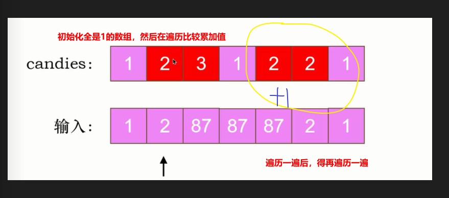

```c#
    public static int Candy(int[] ratings)
    {
        int n = ratings.Length;
        int[] candies = new int[n];
        Array.Fill(candies, 1); //默认糖果全是1;

        bool hasChange = true; //控制孩子糖果的变化，没有变化就不循环了
        while (hasChange)
        {
            hasChange = false;
            for (int i = 0; i < n; i++)
            {
                //不是最后一个孩子，评大于右边的且糖果小于等于右边的，糖果等于右边的+1
                if (i != n - 1 && ratings[i] > ratings[i + 1] && candies[i] <= candies[i + 1])
                {
                    candies[i] = candies[i + 1] + 1;
                    hasChange = true;
                }
                
                //如果评分大于左边的，糖果小于等于左边的，等于左边的+1
                if (i != 0 && ratings[i] > ratings[i - 1] && candies[i] <= candies[i - 1])
                {
                    candies[i] = candies[i - 1] + 1;
                    hasChange = true;
                }
            }
        }
       
        int sum = 0;
        foreach (var candy in candies)
        {
            sum += candy;
        }

        return sum;
    }

```

#####  两个数组，两次遍历

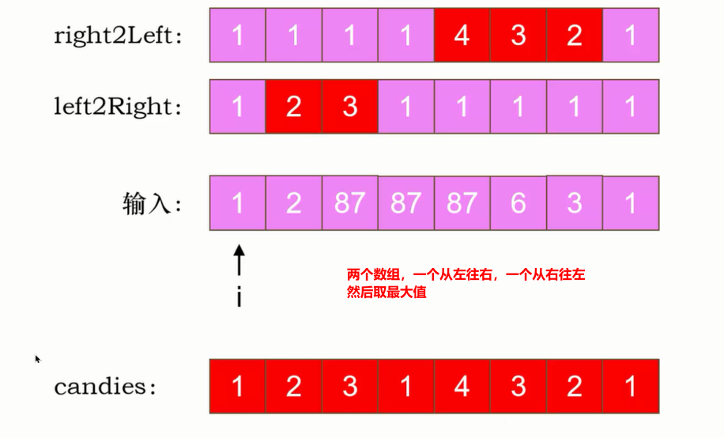

```c#
 public int Candy(int[] ratings) {
        //两个数组，一个从左往右，一个从右往左，然后取最大值
        int n = ratings.Length;
        int[] left = new int[n];
        Array.Fill(left, 1);
        int[] right = new int[n];
        Array.Fill(right, 1);

        for (int i = 0; i < n; i++)
        {
            if (i != 0 && ratings[i] > ratings[i - 1])
            {
                left[i] = left[i - 1] + 1;
            }
        }
        int sum = 0;
        for (int i = n - 1; i >= 0; i--)
        {
            if (i != n - 1 && ratings[i] > ratings[i + 1])
            {
                right[i] = right[i + 1] + 1;
            }
        
            sum += Math.Max(left[i], right[i]);
           
        }
        return sum;
    }
```

#### 605 种花问题


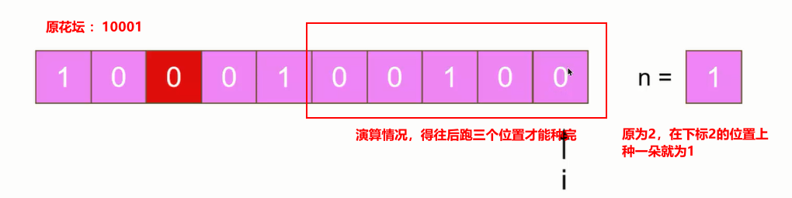

```c#
    public bool CanPlaceFlowers(int[] flowerbed, int n)
    {
        int i = 0;
        //当花坛遍历完，花种完了，停止循环
        while (i < flowerbed.Length && n > 0)
        {
            if (flowerbed[i] == 1)
            {
                i += 2;
            }
            else if ( i==flowerbed.Length-1 ||flowerbed[i + 1] == 0)//flowerbed[i] == 0 上面if说明前面是0 flowerbed[i + 1]才能种！！
            {
                //i没有种花，且是最后一个花坛 i和i+1的位置都没有种花， 那么i位置一定能种花
                n--;
                //然后得到i+2的位置才能继续种
                i += 2;
            }
            else
            {
                //i没有种花，i+1种花，那么得到i+3才能种
                i += 3;
            }
        }
        return n <= 0;
    }

```

#### 860 柠檬水找零

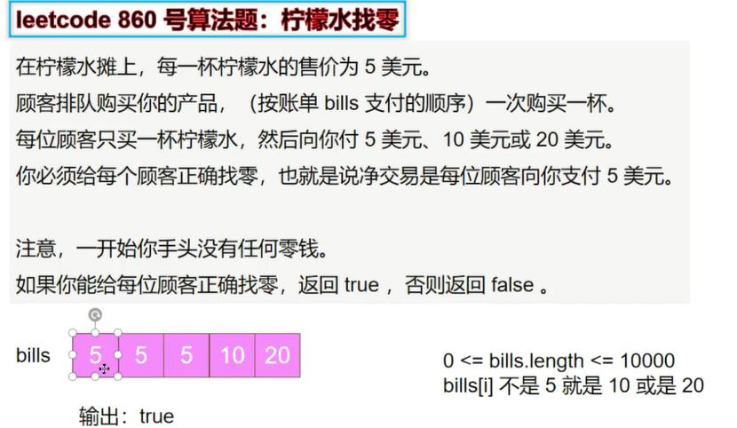

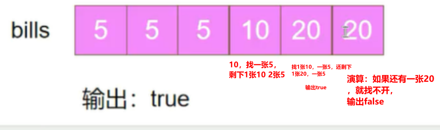

```c#
    public static bool LemonadeChange(int[] bills)
    {
        //记住5有几张，10有几张
        int five = 0;
        int ten = 0;
        foreach (var bill in bills)
        {
            if (bill == 5)
            {
                five++;
            }
            else if (bill == 10)
            {
                if (five == 0) return false; //没有5就没法找就返回false
                //能找开就减去一张五，加张十
                five--;
                ten++;
            }
            else
            {//如果给的是20，就看有没有10和5，有就找
                if (ten > 0 && five > 0)
                {
                    ten--;
                    five--;
                }//或者用三种5找
                else if (five >= 3)
                {
                    five -= 3;
                }
                else//都没有就找不开
                {
                    return false;
                }
            }
        }
        return true;
    }

```


### 二维数组

#### 867 转置矩阵

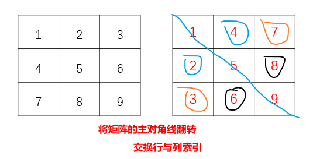

```c#
public int[][] Transpose(int[][] matrix)
    {
        //获取矩阵的行与列数
        int m = matrix.Length;
        int n = matrix[0].Length;
        int[][] transposed = new int[n][];//存储转置后的矩阵行列数
        for (int i = 0; i < n; i++)
        {
            transposed[i] = new int[m];
        }
        //调换一下
        for (int i = 0; i < m; i++)
        {
            for (int j = 0; j < n; j++)
            {
                //交换行列索引
                transposed[j][i] = matrix[i][j];
            }
        }
        return transposed;
    }


```

#### 48选择图像

##### 原地翻转写法

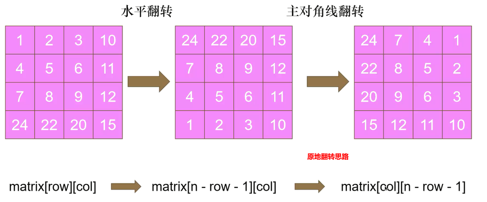

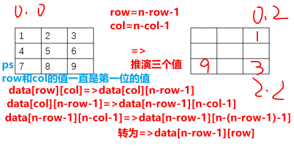

第四个值的推演为 data【n-row-1】【row】=>data【row】【n-(n-col-1)-1】=>data【row】【col】

所以7的值为【0,0】

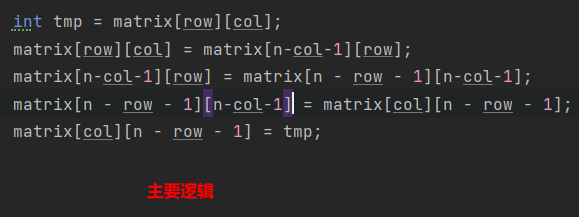


```

```


##### 使用额外数组写法

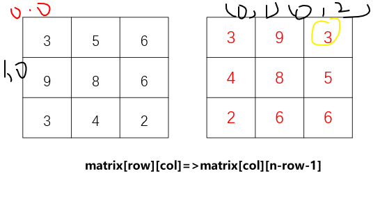

```c#
	/// <summary>
    /// 使用额外数组的写法
    /// </summary>
    public void Rotate1(int[][] matrix)
    {
        int n = matrix.Length;
        int[,] newMatrix = new int[n, n];

        for (int row = 0; row < n; row++)
        {
            for (int col = 0; col < n; col++)
            {
                newMatrix[col, n - row - 1] = matrix[row][col];
                
            }
        }

        for (int row = 0; row < n; row++)
        {
            for (int col = 0; col < n; col++)
            {
                matrix[row][col] = newMatrix[row, col];
            }
        }
    }
```


##### 翻转代替选择 !

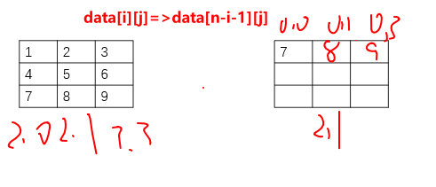

PS:这里索引写错了 

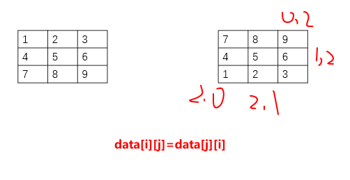

```c#
 public void Rotate(int[][] matrix) {
        int n = matrix.Length;
        // 水平翻转
        for (int i = 0; i < n / 2; ++i) {
            for (int j = 0; j < n; ++j) {
                int temp = matrix[i][j];
                matrix[i][j] = matrix[n - i - 1][j];
                matrix[n - i - 1][j] = temp;
            }
        }
        // 主对角线翻转
        for (int i = 0; i < n; ++i) {
            for (int j = 0; j < i; ++j) {
                int temp = matrix[i][j];
                matrix[i][j] = matrix[j][i];
                matrix[j][i] = temp;
            }
        }
    }
```

#### 36 有效的数独

```c#
    public bool IsValidSudoku(char[][] board)
    {
        //行列 宫格数字出现的情况
        bool[][] rowUsed = new bool[9][];
        bool[][] colUsed = new bool[9][];
        bool[][] boxUsed = new bool[9][];

        for (int i = 0; i < 9; i++)
        {
            rowUsed[i] = new bool[10];
            colUsed[i] = new bool[10];
            boxUsed[i] = new bool[10];
        }
        
        for (int row = 0; row < board.Length; row++)
        {
            for (int col = 0; col < board[0].Length; col++)
            {
                //没有点的地方是数字
                if (board[row][col] != '.')
                {
                    //将数字转化为索引
                    int num= board[row][col] - '1';
                    //判断行列上是否出现了这个数字出现了就是false
                    if (rowUsed[row][num]) return false;
                    else rowUsed[row][num] = true;
                    if (colUsed[col][num]) return false;
                    else colUsed[col][num] = true;
                    //转换为九宫格 判断在宫格里有没有出现这个数字
                    int boxIndex = row / 3 + (col / 3) * 3;
                    if (boxUsed[boxIndex][num]) return false;
                    else boxUsed[boxIndex][num] = true;
                }
            }
        }
        return true;
    }

```

#### 73 矩阵置零

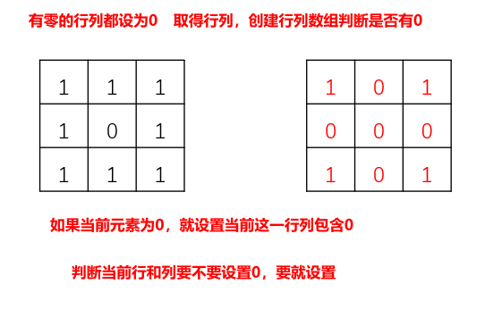

```c#
    public void SetZeroes(int[][] matrix)
    {
        int m = matrix.Length;
        int n = matrix[0].Length;

        //记录行列是否要设置为0
        bool[] rows = new bool[m];
        bool[] cols = new bool[n];

        for (int row = 0; row < m; row++)
        {
            for (int col = 0; col < n; col++)
            {
                if (matrix[row][col]==0)
                {
                    rows[row] = true;
                    cols[col] = true;
                }
            } 
        }
        
        for (int row = 0; row < m; row++)
        {
            for (int col = 0; col < n; col++)
            {
                if (rows[row]||cols[col])
                {
                    matrix[row][col] = 0;
                }
            }
        }
    }

```

#### 54 螺旋矩阵

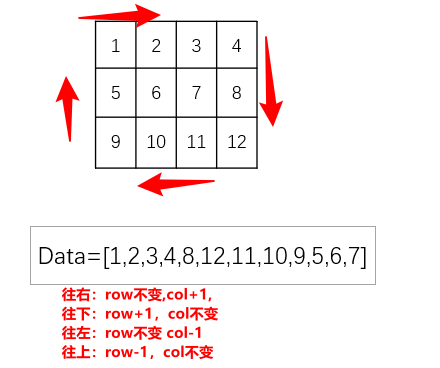

```c#
public IList<int> SpiralOrder(int[][] matrix)
    {
        //用2x2的数组表示方向，往右，往下，往左，往上
        int[][] dirs =
        {
            new int[] {0, 1},
            new int[] {1, 0},
            new int[] {0, -1},
            new int[] {-1, 0}
        };

        int m = matrix.Length;
        int n = matrix[0].Length;
        int row = 0, col = 0;
        int di = 0; //第几行
        List<int> res = new List<int>(); //结果集
        bool[][] see = new bool[m][];
        for (int i = 0; i < m; i++)
        {
            see[i] = new bool[n];
        }
        for (int i = 0; i < m * n; i++)
        {
            res.Add(matrix[row][col]);
            see[row][col] = true;//访问过的元素设置为true
            //往右
            int nextrow = row + dirs[di][0];
            int nextcol = col + dirs[di][1];
            if (nextrow < 0 || nextrow >= m 
                || nextcol < 0 || nextcol >= n||see[nextrow][nextcol])
            {
                //改变方向
                di = (di + 1) % 4;
            }
            row = row + dirs[di][0];
            col = col + dirs[di][1];
        }
        return res;
    }
```

按层模拟的解法

```c#
    /// <summary>
    /// 按层模拟
    /// </summary>
    public IList<int> SpiralOrder(int[][] matrix)
    {
        List<int> res = new List<int>();
        int startRow = 0, endRow = matrix.Length - 1;
        int startCol = 0, endCol = matrix[0].Length - 1;


        while (startRow <= endRow && startCol <= endCol)
        {
            //top行
            for (int col = startCol; col <= endCol; col++) res.Add(matrix[startRow][col]);
            //right行
            for (int row = startRow + 1; row <= endRow; row++) res.Add(matrix[row][endCol]);
            if (startRow < endRow && startCol < endCol)
            {
                //bottom行
                for (int col = endCol - 1; col > startCol; col--) res.Add(matrix[endRow][col]);
                //left行
                for (int row = endRow; row > startRow; row--) res.Add(matrix[row][startCol]);
            }

            startRow++;
            endRow--;
            startCol++;
            endCol--;
        }

        return res;
    }

```

#### 59 螺旋矩阵II

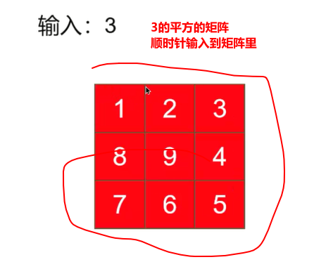

```c#
    //与54思路差不多
    public static int[][] GenerateMatrix(int n)
    {
        //用2x2的数组表示方向，往右，往下，往左，往上
        int[][] dirs =
        {
            new int[] {0, 1},
            new int[] {1, 0},
            new int[] {0, -1},
            new int[] {-1, 0}
        };

        int row = 0, col = 0;
        int di = 0; //第几行
        int[][] res = new int[n][]; //结果集
        for (int i = 0; i < n; i++)
        {
            res[i] = new int[n];
        }
        bool[][] see = new bool[n][];
        for (int i = 0; i < n; i++)
        {
            see[i] = new bool[n];
        }

        for (int i = 0; i < n * n; i++)
        {
            res[row][col] = i + 1;//输入进矩阵的值是1到n的平方，i是0到n-1；
            see[row][col] = true; //访问过的元素设置为true
            //往右
            int nextrow = row + dirs[di][0];
            int nextcol = col + dirs[di][1];
            if (nextrow < 0 || nextrow >= n || nextcol < 0 || nextcol >= n || see[nextrow][nextcol])
            {
                //改变方向
                di = (di + 1) % 4;
            }

            row = row + dirs[di][0];
            col = col + dirs[di][1];
        }

        return res;
    }

```

#### 498 对角线遍历

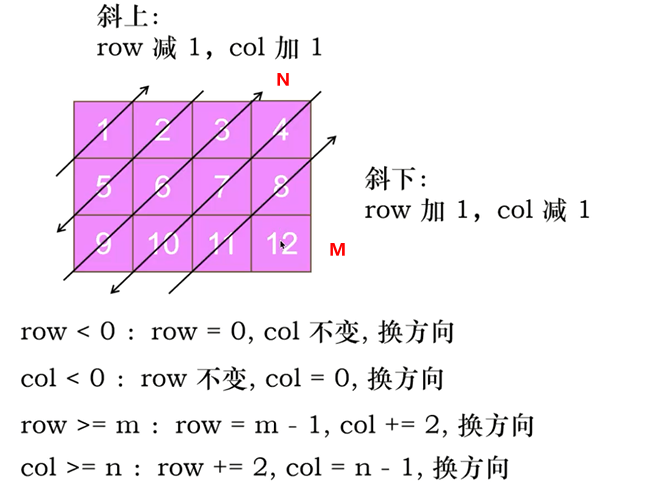

越界情况上图  

补充 遇到三乘三的矩阵的话，应该是先执行 col >=n 的逻辑再执行 row<0， 四乘四的先执行 row>=m再执行col<0

```c#
    public static int[] FindDiagonalOrder(int[][] mat)
    {
        if (mat.Length == 0) return Array.Empty<int>();

        int m = mat.Length;
        int n = mat[0].Length;
        int[] result = new int[m * n];
        int row = 0,
            col = 0, //从第一个元素开始遍历
            di = 0; //当前的方向
        int[][] dirs = {new int[] {-1, 1}, new int[] {1, -1}}; //两个方向 斜上和斜下
        for (int i = 0; i < m * n; i++)
        {
            result[i] = mat[row][col];
            row = row + dirs[di][0];
            col = col + dirs[di][1];

            //越界情况 四种
            if (col >= n){ col = n - 1; row += 2; di = 1 - di; } //如果是1就换成0 如果是0就换成1 就两个方向
            if (row >= m) { row = m - 1; col += 2; di = 1 - di; }
            if (col < 0) { col = 0; di = 1 - di; }
            if (row < 0) { row = 0; di = 1 - di; }
        }

        return result;
    }

```

#### 118 杨辉三角

```c#
    public static IList<IList<int>> Generate(int numRows)
    {
        IList<IList<int>> rows = new List<IList<int>>();
        for (int row = 0; row < numRows; row++)
        {
            List<int> OneRows = new List<int>();
            for (int col = 0; col <= row; col++)
            {
                //头尾部分
                if (col == 0 || col == row)
                {
                    OneRows.Add(1);
                }
                else
                {
                    //上一行的两个加起来
                    OneRows.Add(rows[row - 1][col - 1] + rows[row-1][col]);
                }
            }

            rows.Add(OneRows);
        }

        return rows;
    }

```

#### 119 杨辉三角II

```c#
    public static IList<int> GetRow(int rowIndex)
    {
        IList<IList<int>> result = new List<IList<int>>();
        for (int row = 0; row <= rowIndex; row++)
        {
            var list = new List<int>(row + 1);
            for (int col = 0; col < row + 1; col++)
            {
                int element;
                //头尾部分
                if (row == 0 || col == 0 || col == row)
                {
                    element = 1;
                }
                else
                {
                    //上一行的两个加起来
                    element = result[row - 1][col - 1] + result[row - 1][col];
                }

                list.Add(element);
            }
            if (rowIndex == 1)
            {
                return list;
            }

            result.Add(list);
        }

        return result.Last();
    }

```

