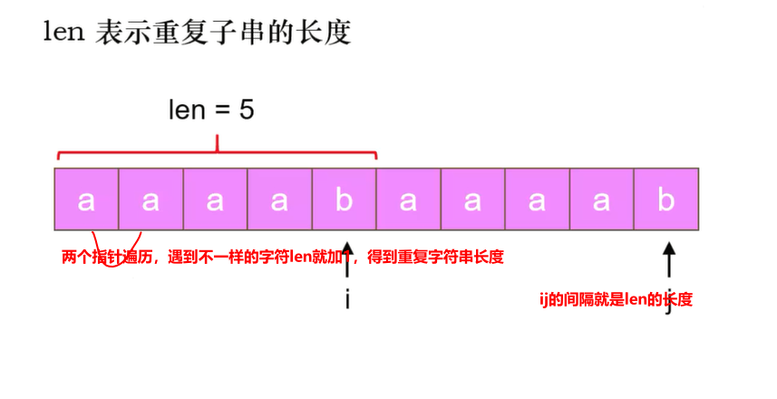
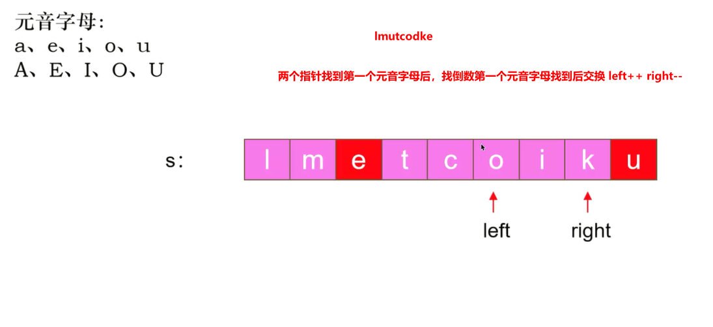
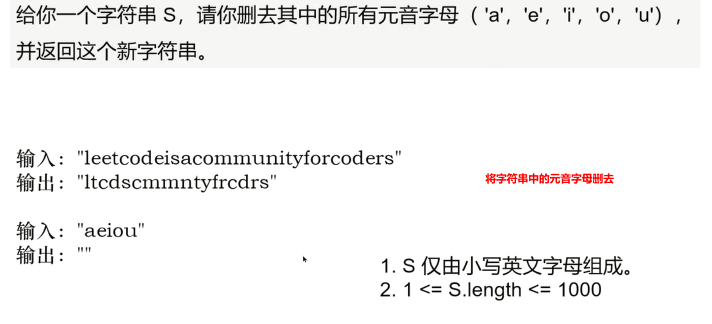
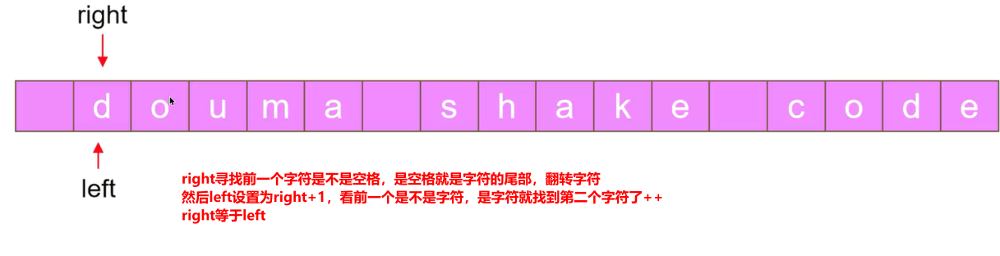

### 字符串

#### 28 找出字符串中第一个匹配项的下标

```c#
    public static int StrStr(string haystack, string needle)
    {
        int h = haystack.Length;
        int n = needle.Length;
        for (int i = 0; i <= h - n; i++)
        {
            int initI = i; //记住第一次相等的元素
            bool match = true;
            for (int j = 0; j < n; j++, i++)
            {
                if (haystack[i] != needle[j]) //如果位置不相等就把match设为false，相等的话，指针移动
                {
                    match = false;
                    break;
                }
            }

            if (match) //等字符串遍历完，如果match是true，说明找到了，就把上面记住的位置返回出去，就是第一次相等的位置
            {
                return initI;
            }

            i = initI;
        }

        return -1;
    }

```

#### 459 重复的子字符串



```c#
    //len最大为l的一半长度，l一定是len的倍数
    public static bool RepeatedSubstringPattern(string s)
    {
        int l = s.Length;
        for (int len = 1; len * 2 <= l; len++)
        {
            if (l % len == 0)
            {
                bool match = true;
                int i = 0;
                for (int j = len; j < l; j++,i++)
                {
                    if (s[i] != s[j])
                    {//如果两个字符不相等就把len+1继续遍历，
                        //相等的话match是true的就返回true
                        match = false;
                        break;
                    }
                }
                if (match) return true;
            }
        }
        return false;
   }
```

```c#
    public static bool RepeatedSubstringPattern2(string s)
    {
        //由重复字符串组成的字符串，选择重复子字符串后会得到本身
        //拼接两个字符，在组成的字符上面判断有没有s ps去掉头部和尾部的元素
        return (s + s).IndexOf(s, 1) != s.Length;
    }

```

#### 345. 反转字符串中的元音字母



```c#
    public static string ReverseVowels(string s) {
        int n = s.Length;
        char[] chars = s.ToCharArray();

        //两个指针，一个从头，一个尾部开始
        int left = 0, right = n - 1;
        while (left < right) {
            //如果左边的指针小于右边的，并且字符串里的元素 没有元音字母就移动指针，有就交换
            while (left < right && !isVowel(chars[left])) left++;
            while (left < right && !isVowel(chars[right])) right--;
            
            char temp = chars[left];
            chars[left] = chars[right];
            chars[right] = temp;

            left++;
            right--;
        }
        return new string(chars);
    }
    public static bool isVowel(char c)
    {
        return c == 'a' || c == 'e' || c == 'i' || c == 'o' || c == 'u' || c == 'A' || c == 'E' || c == 'I' ||
               c == 'O' || c == 'U';
    }
    

```

#### 1119 删去字符串中的元音



```c#
 public static string RemoveStringVowels(String s)
    {
        //设置一个结果集
        StringBuilder res = new StringBuilder();
        foreach (var value in s.ToCharArray() )
        {//遍历字符床不是元音字母的字符就添加到结果集里
            if (!isVowel(value)) res.Append(value);
        }
        return res.ToString();
    }
    public static bool isVowel(char c)
    {
        return c == 'a' || c == 'e' || c == 'i' || c == 'o' || c == 'u';
    }
```

#### 541翻转字符串II

```c#
    public static string ReverseStr(string s, int k)
    {
        char[] chars = s.ToCharArray();
        for (int start = 0; start < s.Length; start += 2 * k)
        {//每次遍历跳2K个字符
            int left = start;
            //左指针从头，右指针从k的位置上
            //PS:主要是判断后面 k个字符是否超过数组的长度，如果超过，就将后面的所有字符反转
            int right = Math.Min(left + k - 1, s.Length - 1);
            while (left<right)
            {
                char temp = chars[left];
                chars[left] = chars[right];
                chars[right] = temp;
                left++;
                right--;
            }
            
        }
        return new string(chars);
    }

```

#### 557反转字符串中的单词 III



```c#
    public static string ReverseWords(string s)
    {
        char[] chars = s.ToCharArray();
        int n = s.Length;

        int left = 0;
        while (left<n)
        {//不等于空就说明字符的开始
            if (chars[left]!=' ')
            {
                int right = left;
                //如果right前面的元素不是空格就再找到，是空格就说明找到字符的尾部了，翻转字符
                while (right + 1 < n && chars[right + 1] != ' ') right++;
                ReverseWord(chars, left, right);
                //反转完就把left设置到right+1的位置，重复过程
                left = right + 1;
            }
            else
            {
                left++;
            }
        }
        return new string(chars);
    }
    private static void ReverseWord(char[] chars, int start, int end)
    {
        char temp;
        while (start<end)
        {
            temp = chars[start];
            chars[start] = chars[end];
            chars[end] = temp;
            start++;
            end--;
        }
    }

```

#### 58 最后一个单词的长度

```c#
    public static int LengthOfLastWord(string s)
    {
        int result = 0;
        int start = 0, end = 0;
        while (end < s.Length)
        {
            if (s[start] == ' ')
            {
                start++;
                end++;
            }

            while (end < s.Length && s[end] != ' ') end++;
            result = end - start;
            while (end < s.Length && s[end] == ' ') end++;
            if (end < s.Length && s[end] != ' ')
            {
                start = end;
            }
        }

        return result;
    }

```

#### 8. 字符串转换整数 (atoi)

```c#
public static int MyAtoi(string s)
{
    char[] chars = s.ToCharArray();

    int i = 0;
    //丢弃前面空格
    while (i < s.Length && chars[i] == ' ') i++;
    if (i == s.Length) return 0;

    //检查+和—是否存在
    int sign = 1;
    if (chars[i] == '-' || chars[i] == '+')
    {
        sign = chars[i] == '-' ? -1 : 1;
        i++;
    }

    //结果检查，防止溢出
    int b = 0;
    while (i < chars.Length && chars[i] >= '0' && chars[i] <= '9')
    {
        //检查  2147483648  -2147483648 最大值
        if (b > Int32.MaxValue / 10 || (b == Int32.MaxValue / 10 && chars[i] - '0' > 7))
        {
            if (sign > 0)
                return Int32.MaxValue;
            else
                return Int32.MinValue;
        }

        b = b * 10 + (chars[i] - '0');
        i++;
    }

    return sign * b;
}
```

#### 165. 比较版本号

```c#
    public static int CompareVersion(string version1, string version2)
    {
        string[] v1 = version1.Split(".");
        string[] v2 = version2.Split(".");
        
        for (int i = 0; i < v1.Length||i<v2.Length; ++i)
        {
            int x = 0; int y = 0;
            if (i<v1.Length)
            {
                x = int.Parse(v1[i]);
            }
            if (i<v2.Length)
            {
                y = int.Parse(v2[i]);
            }
            
            if (x>y)
            {
                return 1;
            }
            if (x<y)
            {
                return -1;
            }
        }
        return 0;
    }

```

#### 12 整数转罗马数字

```c#
    public static string IntToRoman(int num)
    {
        //将所有的情况都作成数组
        int[] nums = {1000, 900, 500, 400, 100, 90, 50, 40, 10, 9, 5, 4, 1};
        String[] romans = {"M", "CM", "D", "CD", "C", "XC", "L", "XL", "X", "IX", "V", "IV", "I"};
        StringBuilder res = new StringBuilder();
        int index = 0;
        while (index < 13)
        {
            //里面的元素值小于num的值，指针移动
            while (nums[index] <= num)
            {
                //结果集压入一个I，然后num值减1，然后拼接进三个I ps，按位算
                res.Append(romans[index]);
                
                num -= nums[index];
            }
            index++;
        }

        return res.ToString();
    }

```


#### 13 罗马数字转整数

```c#
    public static int RomanToInt(String s) {
        int sum = 0;
        int pre = getValue(s[0]);
        for (int i = 1; i < s.Length; i++) {
            int curr = getValue(s[i]);
            if (pre < curr) {
                sum -= pre;
            } else {
                sum += pre;
            }
            pre = curr;
        }
        sum += pre;
        return sum;
    }

    private static int getValue(char ch) {
        switch(ch) {
            case 'I': return 1;
            case 'V': return 5;
            case 'X': return 10;
            case 'L': return 50;
            case 'C': return 100;
            case 'D': return 500;
            case 'M': return 1000;
            default: return 0;
        }
    }

```

### 数学