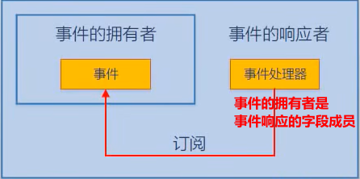

事件(Event)

1. 角色， 使对象或类具备通知能力的成员
2. 事件的功能=通知+可选的通知参数
3. 使用， 用于对象或类间的动作调节与信息传递
4. EventHandler委托的参数一般有两个 一个是object类型，名字是sender实际上就是事件的拥有者，事件的soure
5. 第二个是EventArgs类的派生类 参数为e
6. 事件的本质是委托字段的一个包装器 对委托字段的访问起限制作用

```
注意 
事件处理器是方法成员
挂接事件处理器的时候，可以使用委托实例 也可以直接使用方法名
事件处理器对事件的订阅不是随意的，匹配与否由声明事件时所使用的委托实例来检测
事件可以同步也可以异步
事件不管是表层约束还是底层实现来讲，都是依赖于委托类型
```

#### 事件模型有五个组成部分

1. 事件的拥有者 event soure，对象
2. 事件的成员 event 成员
3. 事件的响应器 event subscriber，对象
4. 事件的处理器 event Handler， 成员 ---本质上是一个回调方法
5. 事件订阅 —— 把事件处理器与事件关联在一起，本质上是一种以委托类型为基础的约定

#### 1.较为简单的事件模型

```c#
namespace Test.Event
{
    public class Event_Handler
    {
        public static void Test()
        {
            Timer _timer = new Timer(); //事件的拥有者
            _timer.Interval = 1000;
            Boy boy = new Boy();//响应者
            Girl girl = new Girl();
            _timer.Elapsed += boy.Action;// +=订阅者   Elapsed 事件
            _timer.Elapsed += girl.Action;
            _timer.Start();
            Console.ReadLine();
        }
    }

    class Boy
    {
        //事件的处理器
        public void Action(object sender, ElapsedEventArgs e)
        {
            Console.WriteLine("Jump");
        }
    }

    class Girl
    {
        public void Action(object sender, ElapsedEventArgs e)
        {
            Console.WriteLine("Sing");
        }
    }
}
```

#### 2.两个对象之间的事件处理器

事件响应者（事件处理器）—>（订阅）事件的拥有者(事件)

```c#
using System.Windows.Forms;
using System;
namespace Test.Event
{
    //两个对象之间的事件处理器
    public class Eventone
    {
        public static void Test()
        {
            Form form = new Form();//拥有者 form
            Controller c = new Controller(form);//响应者 c
            form.ShowDialog();
        }
    }
    class Controller
    {
        private Form Form;

        public Controller(Form form)
        {
            if (form!=null)
            {
                this.Form = form;
                this.Form.Click += this.FormClicked;//事件 和 订阅
            }
        }

        //处理器
        //不能拿影响Elapsed事件的事件处理器去响应Click事件
        //因为遵循的约束不同，所以不通用
        private void FormClicked(object sender, EventArgs e)
        {
            this.Form.Text = DateTime.Now.ToString();
        }
    }
}
```

#### 3.事件的拥有者同时也是事件的响应者

对象xx（事件处理器---> 事件）

```c#
public class EventTow
{
    public static void Test()
    {
        MyForm myForm = new MyForm(); //拥有者
        myForm.Click += myForm.MyFormClicked; //事件  响应者是myForm自己 +=订阅
        myForm.ShowDialog();
    }
}

//派生: 在原有类的功能的基础上 ，扩展新的功能 
class MyForm:Form
{
    //处理器
    public void MyFormClicked(object sender, EventArgs e)
    {
        this.Text = DateTime.Now.ToString();
    }
}
```

4.事件的拥有者是事件响应的字段成员



```c#
using System;
using System.Timers;
using System.Windows.Forms;

namespace Test.Event
{
    public class Event
    {
        public static void Test()
        {
            myForm form = new myForm(); //响应
            form.ShowDialog();
        }
    }
    class myForm :Form
    {
        private TextBox _textBox;
        private Button _button; //事件拥有者
        public myForm()
        {
            this._textBox = new TextBox();
            this._button = new Button();
            this.Controls.Add(_textBox);
            this.Controls.Add(_button);
            this._button.Click += this.BottomClicked; //事件 订阅
            this._button.Text = "点我";
            this._button.Top = 100;
        }
        private void BottomClicked(object sender, EventArgs e)
        {
            this._textBox.Text = "Hello Heart";
        }
    }
}
```


##### 案例

```c#
using System;
using System.Threading;

//一个吃饭的事件模拟，多复习
namespace Test.Event
{
    //委托 委托可引用的方法返回值类型  名字+EventHandler后缀 （引用方法的参数列表 1，对象，2 事件信息）
    //public delegate void OrderEventHandler(Customer customer, OrderEventArgs e);

    public class Event_Eat
    {
        public static void Test()
        {
            Customer c = new Customer();
            Waiter w = new Waiter();
            c.Order += w.Action;
            c.Action();
            c.PlayBill();
        }
    }

    //传递事件的消息 信息
    public class OrderEventArgs : EventArgs
    {
        public string DishName { get; set; }
        public string Size { get; set; }
    }

    public class Customer
    {
        //声明事件
        /*private OrderEventHandler OrderEventHandler;
        public event OrderEventHandler Order
        {
            //Value是一个重要的关键字
            add { this.OrderEventHandler += value; }
            remove { this.OrderEventHandler -= value; }
        }*/

        //简化声明
        //public event OrderEventHandler Order;
        //两种事件
        public event EventHandler Order;

        public double Bill { get; set; } //账单

        public void PlayBill()
        {
            Console.WriteLine("我支付了{0}", this.Bill);
        }
        void WalkIn()
        {
            Console.WriteLine("走进餐厅");
        }
        public void SitDown()
        {
            Console.WriteLine("坐下");
        }
        public void Think()
        {
            for (int i = 0; i < 5; i++)
            {
                Console.WriteLine("让我想想");
                Thread.Sleep(1000);
            }

            /*简化声明用这里Order替换
             if (this.OrderEventHandler!=null)
             {
                 OrderEventArgs e = new OrderEventArgs();
                 e.DishName = "宫爆鸡丁";
                 e.Size = "large";
                 this.OrderEventHandler.Invoke(this,e);//触发时间的地方
             }
            
             if (this.Order!=null)
             {
                 OrderEventArgs e = new OrderEventArgs();
                 e.DishName = "宫爆鸡丁";
                 e.Size = "large";
                 this.Order.Invoke(this,e);//触发时间的地方
             }*/
            this.OnOrder("酸菜鱼", "大份");
        }

        // protected 用来修饰触发事件的方法 不建议为public
        //事件的命名尽量用动词
       //触发事件
        protected void OnOrder(string DishName, string Size)
        {
            if (this.Order != null)
            {
                OrderEventArgs e = new OrderEventArgs();
                e.DishName = DishName;
                e.Size = Size;
                this.Order.Invoke(this, e); //触发时间的地方
            }
        }

        //事件触发
        public void Action()
        {
            Console.ReadLine();
            this.WalkIn();
            this.SitDown();
            this.Think();
        }
    }

    public class Waiter
    {
        /*public void Action(Customer customer, OrderEventArgs e)
        {
            Console.WriteLine("上的菜是{0}", e.DishName);
            double price = 10;
            switch (e.Size)
            {
                case "smaill":
                    price = price * 0.5;
                    break;
                case "large":
                    price = price * 1.5;
                    break;
                default:
                    break;
            }
            customer.Bill += price;
        }*/


        public void Action(object sender, EventArgs e)
        {
            Customer c = sender as Customer;
            OrderEventArgs orderEventArgs = e as OrderEventArgs;
            Console.WriteLine("上的菜是{0}", orderEventArgs.DishName);
            double price = 10;
            switch (orderEventArgs.Size)
            {
                case "小份":
                    price = price * 0.5;
                    break;
                case "大份":
                    price = price * 1.5;
                    break;
                default:
                    break;
            }
            c.Bill += price;
        }
    }
}