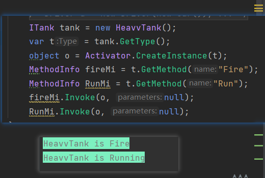
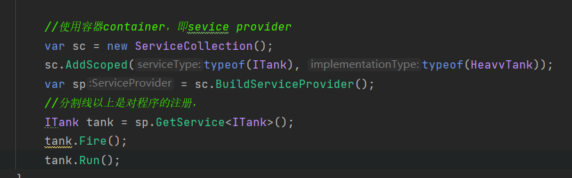

#### 反射

###### 程序集

程序集是经由编译器编译得到的，供进一步编译执行的之间产物。在Windows系统中，它一般表现为后缀为.**dl**l(库文件)或者.**exe**(可执行文件)的格式。

简单理解：**程序集**就是我们写的一个**代码集合**，我们现在写的所有代码最终都会被编译器翻译为一个程序集供给他人使用，比如一个代码库文件(dll)或者一个可执行文件(exe)。

###### 元数据

元数据就是用来描述数据的数据。这个概念不仅仅用于程序，在别的领域也有元数据。

简单理解：程序中的类，类中的函数，变量等等信息就是程序的元数据，有关程序以及类型的数据被称为元数据，它们保存在程序集中。

###### 反射

而程序在运行过程中可以查看其他程序集或者自身的元数据。一个**正在运行**的程序**查看本身或者其他程序的元数据**的行为就叫反射。

简单理解：在程序运行时候，通过反射可以得到其他程序集或者自己程序集代码的各种信息，例如：类、函数、变量、对象等等，实例化它们，执行它们，操作它们。

反射常常与接口、依赖反转原则一起使用。反射事实上是.Net框架的内容，不是C#语言的内容。同时，单元测试、依赖注入、泛型编程，都基于反射机制。

给我一个对象，我能在不知道它是什么静态类型，且不使用new操作符的情况下，再创建出一个与它同类型的新对象，并且能够访问其方法。

简单为

- 程序运行时得到所有元数据，包括元数据的特效
- 程序运行时，实例化对象，操作对象
- 程序运行时创建新对象，用这些对象执行任务

使用new操作符，即是创造了一个紧耦合，直接地将所在类与new后的静态类型紧耦合在了一起。而使用反射，直接避免紧耦合的发生，降低了耦合度。

另一方面，在具体的工程中，在编写程序阶段，因为用户的请求很多变，你很难预测用户需求，不可能写成百上千的if-else语句使用静态的类型枚举出所有可能结果。这就体现了反射的动态效果。反射是在编写程序阶段，不确定具体逻辑的时候存在的。程序需要以不变应万变的能力，这个能力就是反射。

语法相关

```c#
1.Type
使用type的成员获取有关类型声明的信息，有关类型的成员（构造函数 方法 字段 属性 类的事件）
2.GetType
   Object的GetType()可以获取对象的Type  通过类和结构体的名字也可以获取类型 
   ps 类名或者结构体名字必须包含命名空间
   例 Type type3 = Type.GetType("System.Int32");
   typeof()关键字传入类名也可以得到对象的Type 
   ps：每个类都是唯一的，地址也是唯一的，所以每个Type指向的地址都是同一个地址
3.type.Assembly
得到类的程序集信息
4. GetMembers
获取类中的所有公共公开的成员  
ps 命名空间 using System.Reflection
5.GetConstructors();
    获取类的公共构造函数 Type t =tperof（类）
    ConstructorInfo[] ctors = t.GetConstructors();
6.GetFields
    获取类的公共成员变量
7.通过Type类中的GetMethod方法得到类中的方法，MethodInfo是方法的反射信息

其他
    获取枚举：GetEnumName,GetEnumNames
    获取事件：GetEvent,GetEvents
    获取接口：GetInterface,GetInterfaces
    获取属性：GetProperty,GetPropertys
```

我们回到接口Tank的例子 通过反射，我们没有动任何的静态类型，完全从内存里读取类型的描述和方法的描述调用



但是一般不会直接使用反射，而是会使用封装好了的反射。而封装好了的反射最重要的功能就是依赖注入。

#### 依赖注入

依赖注入框架包Microsoft.Extensions.DependencyInjection  

依赖注入是依赖反射原则DIP的一个应用；
不用静态创建类的实例，只关注用了哪种接口和哪种类就可以获取类的成员

依赖注入最重要的是**容器container**，即sevice provider。其中装着很多类型和对应的接口，要实例的时候就向他要就行。



这样做的好处是什么呢？比如说程序有一个地方要改，不要heavytank了，全部变成lighttank。这时候如果用new操作符，就得改多处，而且还不能用一键替换，因为你不知道哪里要改哪里不用改。如果使用这样的封装反射，就只用改第二行就行。

但是依赖注入的强大不止于此

```c#
    class Program
    {
        static void Main()
        {
            var serviceCollection = new ServiceCollection();//容器
            serviceCollection.AddScoped(typeof(ITank), typeof(HeavyTank));
            serviceCollection.AddScoped(typeof(IVehicle), typeof(Car));
            serviceCollection.AddScoped<Driver>();
            //typeof拿到动态类型描述;第一个参数是接口类型，第二个是实现接口类型的类型。
            var serviceProvider = serviceCollection.BuildServiceProvider();
            //-----------------一次性的注册-------------------------------
            var driver = serviceProvider.GetService<Driver>();
            driver.Drive();
        }
    }
    class Driver
    {
        private IVehicle _vehicle;
        public Driver(IVehicle vehicle)
        {
            _vehicle = vehicle;
        }
        public void Drive()
        {
            Console.WriteLine("I am driving a {0}.",_vehicle.GetType().Name);
        }
    }
```

Driver这个类本来要求产生实例时需要构造传入一个IVehicle，现在没传。容器会自动帮你在它已有的类型里面找到一个IVehicle接口的类，然后帮你自动创造一个实例传进去。比如这里就传进去了一个Car。

#### Assembly

程序集类，主要用于加载其他程序集，加载后才能用Type来使用其他程序集中的信息，如果想要使用不是自己程序集中的内容，需要先加载程序集，比如：dll文件（库文件）。简单的把库文件看成一种代码仓库，它提供给使用者一些可以直接拿来用的变量、函数或者类。

三种加载程序集的函数：

1.一般用来加载在同一文件下的其他程序集：Assembly asembly2 = Assembly.LoadFrom(“包含程序集清单的文件的名称或者路径”);


2.一般用来加载不在同一文件下的其他程序集：

Assembly asembly = Assembly.LoadFrom("包含程序集清单的文件的名称或者路径");

Assembly asembly3 = Assembly.LoadFile("要加载的文件的完全限定路径");

~~~C#
// 1.先加载一个指定程序集
// 需要引用命名空间 System.Reflection;
Assembly asembly = Assembly.LoadFrom(@"xxx\xxx\xxx\xxx\xxx.dll");
Type[] types = asembly.GetTypes();// 获取我们程序集中的所有类型
for(int i = 0; i < types.Length; i++){
    Console.WriteLine(types[i]); // 打印我们反射中存储的所有的类型
}

// 2.再加载程序集中的一个类对象，之后才能使用反射
Type icon = asembly.GetType("XXXX.类对象名字");
MemberInfo[] members = icon.GetMembers();// 得到我们icon中存储的所有成员
for(int i = 0; i< members.Length; i++){
    Console.WriteLine(members[i]);
}

// 3.类库(dll库文件)工程创建
解决方案资源管理器->随便一个项目右键->添加->新建项目->选择类库(C# .Net FrameWork)

作用：我们的类库文件一般是运行不了的，一般是用于给我们纯写逻辑代码和算法代码供给他人所用的，它内部不需要Main()方法的，我们一般写好之后，在解决方案资源管理器->点击项目名->右键->生成，然后我们就可以在我们的项目的文件夹下面找到我们的项目文件夹->bin->Debug就可以看到外面的两个文件一个是.dll，还有一个是.pdb。然后我们就可以用我们反射的知识去引用我们的dll文件。

~~~


用于快速实例化对象的类，用于将Type对象快捷实例化为对象，先得到Type，然后快速实例化出一个对象。

~~~C#
Type testType = typeof(Test);
// 1.无参构造
Test testObj = Activator.CreateInstance(testType) as Test;
Console.WriteLine(testObj.str);
// 2.有参数构造
// 得到一个参数的构造函数的实例
// 参数1 反射， 参数2 我们的构造函数参数列表
testObj = Activator.CreateInstance(testType, 99) as Test;
Console.WriteLine(testObj.j);
// 我们再试试获取两个参数构造函数的实例
testObj = Activator.CreateInstance(testType, 55, "111222") as Test;
Console.WriteLine(testObj.j);
// 注意：我们不能传入我们没有实现的构造函数，如果我们传入了我们没有实现的构造函数，运行后会直接报错。
~~~

#### 反射总结

反射：在程序运行时，通过反射可以得到其他程序集或者自己的程序集代码的各种信息，类、函数、变量、对象等等，实例化它们，执行它们，操作它们。

关键类：Type、Assembly、Activator。

为什么学习反射？Unity引擎的基本工作机制就是建立在反射的基础上的，学习反射是为了之后学习Unity引擎的基本工作原理做铺垫。

#### 3.特性

##### 3.1特性是什么？

特性是一种允许我们向程序的程序集添加元数据的语言结构，它是用于保存程序结构信息的某种特殊类型的类。

特性提供功能强大的方法以将声明信息与C#代码（类型、方法、属性等）相关联。

特性与程序实体关联后，即可在运行时使用反射查询特性信息。

特性的目的是告诉编译器把程序结构的某组元数据嵌入程序集中，它可以放置在几乎所有的声明中（类、变量、函数等等申明）。

简单理解：特性本质是一个类，我们可以利用特性类为元数据添加额外信息，比如一个类、成员变量、成员方法等等为他们添加更多的额外信息，之后可以通过反射来获取得到这些额外信息。

##### 3.2自定义特性

在上面我们讲解了特性的本质就是一个类，那么我们只需要先去申明一个类，然后让这个类基础至特性基类Attribute就可以了。

~~~C#
class MyCustomAttribute : Attribute{
    // 这个类的内容其实就是让你最后变成一个元数据的，方便外部利用反射引用的。
	// 特性中的成员
    public string info;
    public MyCustomAttribute(string info){
        this.info = info;
    }
    public void TestFun(){
        Console.WriteLine("特性的方法");
    }
}
~~~

##### 3.3特性的使用

基本语法：[特性名（参数列表）]，本质上就是在调用特性类的构造函数。

写在哪里?类、函数、变量上一行，表示他们具有该特性信息。

~~~C#
// 我们使用我们上一个知识点申明的特性
// 注意：系统会默认帮我们省略了类名后面的Attribute
// 参数列表里面根据我们的构造函数的参数列表传入参数
[MyCustom("这是我自己写的一个用于计算的类")]
class MyClass{
    [MyCustom("这是一个成员变量")]
    public int value;
    [MyCustom("这是一个用于计算加法的函数")]
    public void TestFun([MyCustom("函数参数"int a)]){
        
    }
}

// 特性的作用就是添加额外的信息，当我们通过反射得到这些成员的时候，我们可以获取到特性的信息来知道成员的用法。
// 举例：
class Program{
    static void Main(){
        // 特性的使用
        MyClass mc = new MyClass();
        // 得到Type的三种方法
        // 1.Type t = mc.GetType();
        // 2.t = typeof(MyClass);
        // 3.t = Type.GetType(命名空间名字.MyClass)
        Type t = mc.GetType();
        
        // 判断是否使用了某个特性
        // 参数一：特性的类型
        // 参数二：代表是否搜索继承链（属性和事件忽略此参数）
        // 注意这个方法只是判断类是否使用了特性，类里面的成员是该方法无法判断
        if(t.IsDefined(typeof(MyCustomAtrribute)), false){
            Console.WriteLine("该类型应用了MyCustom特性");
        }
        
        // 获取Type元数据中的所有特性
        object[] array = t.GetCustomAttribute(true);
        for(int i = 0; i < array.Length; i++){
			if(array[i] is MyCustomAttribute){
				Console.WriteLine((array[i] as MyCustomAttribute).info);
                // 因为特性的本质就是一个类，所以我们甚至可以调用其中的方法
                (array[i] as MyCustomAttribute).TestFun();
            }
        }
    }
}
~~~

##### 3.4限制自定义特性的使用范围

~~~C#
// 通过为特性类加特性限制其使用范围
[AttributeUsage(AttributeTargets.Class | AttributeTargets.Struct, AllowMultiple = true, Inherited = true)]
// 参数一：AttributeTargets-----特性能够用在哪些地方
// 参数二：AllowMultiple-----是否允许多个特性实例用在同一个目标上
// 参数三：Inherited-----特性是否能被派生类和重写成员继承
public class MyCustom2Attribute : Attribute{
    
}
~~~

##### 3.5系统自带特性——过时特性

~~~C#
// 过时特性-----Obsolete，用于提示用户使用的方法等成员已经过时，建议使用新方法，一般加在函数前的特性
Class TestClass{
    // 参数一：调用过时方法时提升的内容
    // 参数二：true-使用该方法会报错(编译之前就会报错)，false-使用该方法自己报警告
    [Obsolete("OldSpeak方法已经过时了，请使用Speak方法"), false]
    public void OldSpeak(string str){
        
    }
    public void Speak(){
        
    }
}
~~~

##### 3.6系统自带特性——调用者信息特性

~~~C#
// 哪个文件调用?
CallerFilePath特性
// 哪一行调用？
CallerLineNumber特性
// 哪一个函数调用？
CallerMemberName特性

// 需要引用命名空间 using System.Runtime.CompilerServices;
// 一般作为函数参数的特性
// 举例：
class Test{
    // 注意：我们的调用者信息特性后面是需要有一个默认值的，不然会报错误
    // 特性的默认值也可以让用户在调用函数的时候，指定传入，一般如果没有在调用函数的时候传值，系统会帮我们传入默认值：该文件的路径、该语句的行数、哪个函数在调用该函数。
    public void TestFun(string str, [CallerFilePath]string fileName = "", [CallerLineNumber]int line = 0, [CallerMemberName]string target = ""){
        
    }
}
~~~

##### 3.7系统自带特性——条件编译特性

~~~C#
// 条件编译特性-----Conditional 
// 它会和预处理指令 #define配合使用，使用之前需要引用命名空间 using System.Diagnostics;
// 主要可以用在一些调式代码上，有时想执行有时不想执行的代码
class Program{
    // 注意：一旦我们加了条件编译特性，那么下面这个静态方法Fun()就需要我们预先定义了#define Fun才可以使用，或者说Main()里面的Fun();才会被执行
    [Conditional("Fun")]
    void Static Fun(){
        Console.WriteLine("Fun");
    }
    void static Main(){
        Fun();
    }
}
~~~

##### 3.8系统自带特性——外部Dll包函数特性

~~~C#
// DllImport
// 用来标记非.Net(C#)的函数，表明该函数在一个外部的DLL中定义。
// 一般用来调用C或者C++的Dll包写好的方法，需要引用命名空间 using System.Runtime.InteropServices;
class Program{
    void static Main(){
        [DllImport("Test.dll")]
        // 这句代码是把我们Test.dll包中与下面这个函数一定是存在着一模一样的函数，把C\C++中这个一模一样的函数映射到这个函数中
        public static extern int Add(int a, int b);
    }
}
~~~

##### 特性总结

特性是用于为元数据再添加更多的额外信息（变量、方法等等），我们可以通过反射获取这些额外的数据来进行一些特殊的处理。

自定义特性—继承Attribute类

系统自带特性：过时特性

反射和特性的学习是为了之后Unity引擎学习的，因为Unity引擎中很多地方都用到了特性来进行一些特殊处理。
