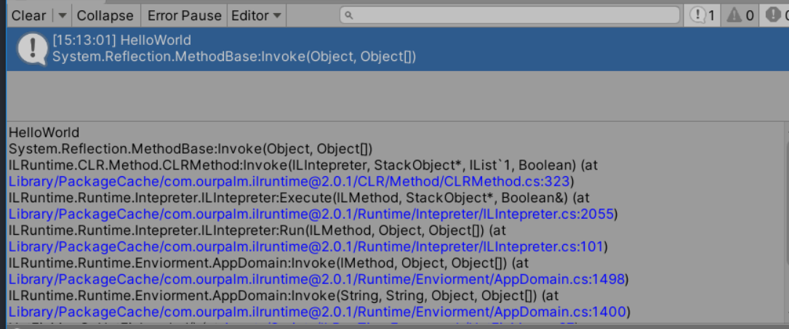
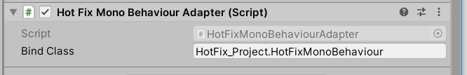
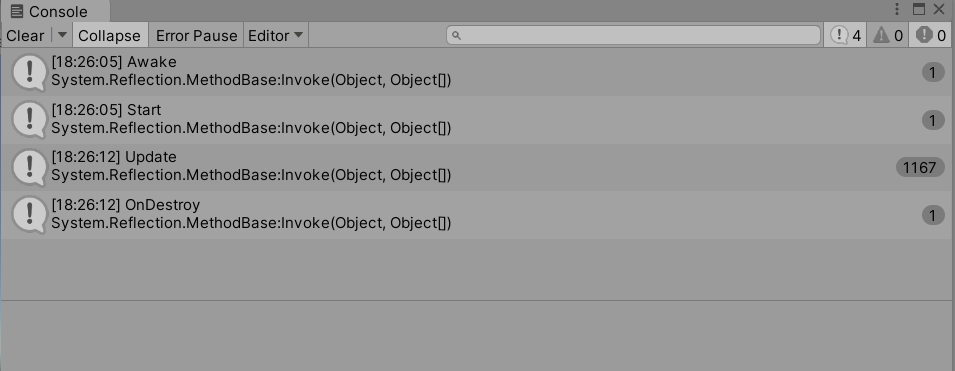
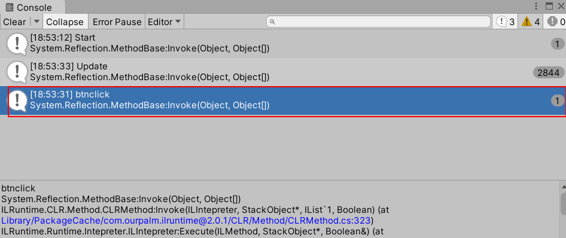
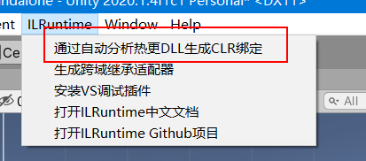
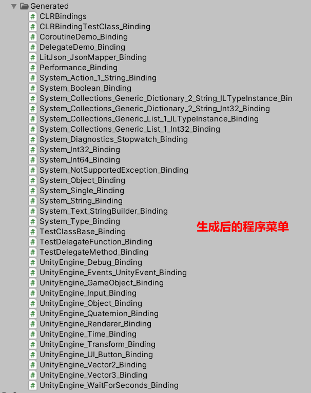
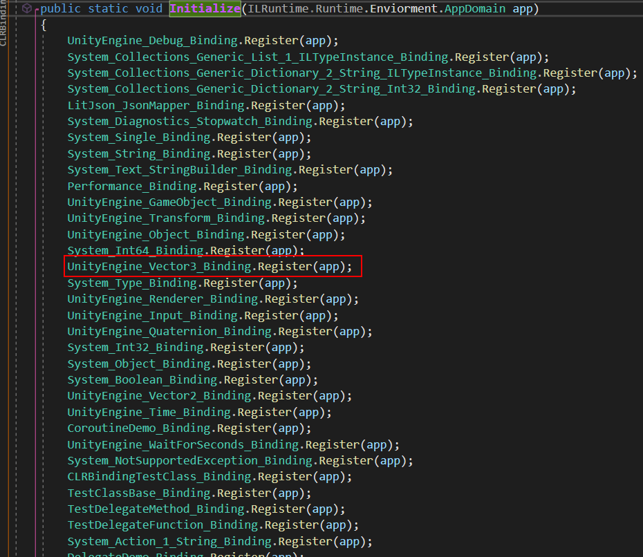

### 1.HelloWord

将ILRuntime导入在Console中发现大量CS0227报错，那么在Player设置中打开允许不安全代码选项（ILRuntime中使用了指针等不安全代码），如此报错信息就解决了， 随后在Demo目录下有一个HotFix_Project~文件夹  这个文件夹以~结尾，Unity会忽略掉它。打开HotFix这个项目，生成解决方案，还有报错的话就回到Unity 将 .Net.2.0改成4x。再生成解决方案。

Unity会生成一个 文件


同时我们在HotFix这个项目内新建一个HotFixHelloWorld的类

```

namespace HotFix_Project
{
   public class HotFixHelloWorld
    {
        static void HelloWorld()
        {
            UnityEngine.Debug.Log("HelloWorld");
        }
    }
}

```

---

在HotFix项目外新建一个HotFixMgr的类 来调用这个HotFixHelloWorld的类内的方法

```C#
public class HotFixMgr : MonoBehaviour
{
    //AppDomain是ILRuntime的入口，最好在一个单例类内保存
    private static HotFixMgr minstance;

    public static HotFixMgr instance
    {
        get
        {
            if (minstance == null)
            {
                minstance = new GameObject("HotFixMgr").AddComponent<HotFixMgr>();
                minstance.LoadHotFixAssembly();
            }

            return minstance;
        }
    }
    //AppDomain是ILRuntime的入口，最好是在一个单例类中保存，整个游戏全局就一个，这里为了示例方便，每个例子里面都单独做了一个
    //大家在正式项目中请全局只创建一个AppDomain
    public AppDomain appdomain;
    System.IO.MemoryStream fs;
    System.IO.MemoryStream p;

    void LoadHotFixAssembly()
    {
        //首先实例化ILRuntime的AppDomain，AppDomain是一个应用程序域，每个AppDomain都是一个独立的沙盒
        appdomain = new ILRuntime.Runtime.Enviorment.AppDomain();
        //正常项目中应该是自行从其他地方下载dll，或者打包在AssetBundle中读取，平时开发以及为了演示方便直接从StreammingAssets中读取，
        //正式发布的时候需要大家自行从其他地方读取dll

        //!!!!!!!!!!!!!!!!!!!!!!!!!!!!!!!!
        //这个DLL文件是直接编译HotFix_Project.sln生成的，已经在项目中设置好输出目录为StreamingAssets，在VS里直接编译即可生成到对应目录，无需手动拷贝
        //工程目录在Assets\Samples\ILRuntime\1.6\Demo\HotFix_Project~
#if UNITY_ANDROID
        WWW www = new WWW(Application.streamingAssetsPath + "/HotFix_Project.dll");
#else
        WWW www = new WWW("file:///" + Application.streamingAssetsPath + "/HotFix_Project.dll");
#endif
        while (!www.isDone)
        {
            Thread.Sleep(100);
        }
        if (!string.IsNullOrEmpty(www.error))
            UnityEngine.Debug.LogError(www.error);
        byte[] dll = www.bytes;
        www.Dispose();

        //PDB文件是调试数据库，如需要在日志中显示报错的行号，则必须提供PDB文件，不过由于会额外耗用内存，正式发布时请将PDB去掉，下面LoadAssembly的时候pdb传null即可
#if UNITY_ANDROID
        www = new WWW(Application.streamingAssetsPath + "/HotFix_Project.pdb");
#else
        www = new WWW("file:///" + Application.streamingAssetsPath + "/HotFix_Project.pdb");
#endif
        while (!www.isDone)
        {
            Thread.Sleep(100);
        }
     
        if (!string.IsNullOrEmpty(www.error))
            UnityEngine.Debug.LogError(www.error);
        byte[] pdb = www.bytes;
        fs = new MemoryStream(dll);
        p = new MemoryStream(pdb);
        try
        {
            appdomain.LoadAssembly(fs, p, new ILRuntime.Mono.Cecil.Pdb.PdbReaderProvider());
        }
        catch
        {
            Debug.LogError("加载热更DLL失败，请确保已经通过VS打开Assets/Samples/ILRuntime/1.6/Demo/HotFix_Project/HotFix_Project.sln编译过热更DLL");
        }


        InitializeILRuntime();
        OnHotFixLoaded();

    }

    private void OnHotFixLoaded()
    {
        //HotFixMgr.instance.appdomain.Invoke("HotFix_Project.HotFixHelloWorld", "HelloWorld", null, null);

    }

    private void InitializeILRuntime()
    {
#if DEBUG && (UNITY_EDITOR || UNITY_ANDROID || UNITY_IPHONE)
        //由于Unity的Profiler接口只允许在主线程使用，为了避免出异常，需要告诉ILRuntime主线程的线程ID才能正确将函数运行耗时报告给Profiler
        appdomain.UnityMainThreadID = System.Threading.Thread.CurrentThread.ManagedThreadId;
#endif
        //这里做一些ILRuntime的注册，HelloWorld示例暂时没有需要注册的

    }
    private void OnDestroy()
    {
        if (fs != null)
            fs.Close();
        if (p != null)
            p.Close();
        fs = null;
        p = null;
    }

}

```

---

随后我们试着输出HelloWord

```C#
public class Demo_HelloWorld : MonoBehaviour
{
    // Start is called before the first frame update
    void Start()
    {
        string className = "HotFix_Project.HotFixHelloWorld";
        string funcName = "HelloWorld";
        HotFixMgr.instance.appdomain.Invoke(className, funcName, null, null);

    }

    // Update is called once per frame
    void Update()
    {
    }
}

```



总结：ILRuntime热更的一个基本的流程是将项目代码打包为dll，这个dll可以直接放在项目文件中（DEBUG阶段），也可以打包到AB包中并从远端下载后加载（RELEASE阶段）。在工程中，使用AppDomain调用dll文件中的相应方法即可实现热更新（可以提供一个固定的开始热更新方法并调用这个方法，然后热更新部分再在这个方法中调用其他热更新资源）。

### 2.基于ILRuntime实现MonoBehaviour行为

热更程序集里拥有MonoBehaviour能力

方法一：继承MonoBehaviour

因为MonoBehaviour隶属于主程序集，热更程序集 继承 主程序集 属于跨域继承

运行性能低，而且需要编写接口适配，无论是性能和开发效率都不具备优势

方法二：自行架构

主工程 适配器

HotFixMonoBehaviourAdapter（通过字符串实例化热更对象，并且调用生命周期的方法，例如Awake Start等）

HotFixMonoBehaviour（实现生命周期函数）

---

我们新建HotFixMonoBehaviourAdapter类

```C#
public class HotFixMonoBehaviourAdapter : MonoBehaviour
{
    public string bindClass;
    private IType classType;
    private ILTypeInstance instance;

    private IMethod start_method;
    private IMethod update_method;
    private IMethod OnDestroy_method;


    void Awake()
    {
        //需要创建的类型
        classType = HotFixMgr.instance.appdomain.LoadedTypes[bindClass];

        //创建实例
        instance = (classType as ILType).Instantiate();

        //通过反射获得生命周期
        IMethod awake_method = classType.GetMethod("Awake", 0);
        start_method = classType.GetMethod("Start", 0);
        update_method = classType.GetMethod("Update", 0);
        OnDestroy_method = classType.GetMethod("OnDestroy", 0);

        if (awake_method != null)
        {
            HotFixMgr.instance.appdomain.Invoke(awake_method, instance);
        }
    }


    private void Start()
    {
        if (start_method != null)
        {
            HotFixMgr.instance.appdomain.Invoke(start_method, instance);
        }
    }

    private void Update()
    {
        if (update_method != null)
        {
            HotFixMgr.instance.appdomain.Invoke(update_method, instance);
        }
    }
    private void OnDestroy()
    {
        if (OnDestroy_method != null)
        {
            HotFixMgr.instance.appdomain.Invoke(OnDestroy_method, instance);
        }
        instance = null;
    }
}
```

HotFixMonoBehaviour类

```C#
namespace HotFix_Project
{
    class HotFixMonoBehaviour
    {
        void Awake()
        {
            Debug.Log("Awake");
        }

        void Start()
        {
            Debug.Log("Start");
        }

        void Update()
        {
            Debug.Log("Update");
        } 
        void OnDestroy()
        {
            Debug.Log("OnDestroy");
        }

    }
}

```

将HotFixMonoBehaviourAdapter挂到游戏物体上，传入命名空间和类名



随后运行后，我们可以看到我们热更程序集里的脚本都运行了，删除游戏对象后，OnDestroy也执行了



### 3.自定义委托注册

我们在HotFix_Project中添加TestRun脚本写一个点击，同时也要记得把Unity的UIDLl引用添加到我们的HotFix_Project中

默认情况下只支持Action Func委托


因为ILRuntime默认情况下只支持系统默认的委托，而UnityAction属于自定义委托，所以我们要自己写委托来兼容，回到HotFixMgr脚本InitializeILRuntime 添加委托

```c#
    private void InitializeILRuntime()
    {
#if DEBUG && (UNITY_EDITOR || UNITY_ANDROID || UNITY_IPHONE)
        //由于Unity的Profiler接口只允许在主线程使用，为了避免出异常，需要告诉ILRuntime主线程的线程ID才能正确将函数运行耗时报告给Profiler
        appdomain.UnityMainThreadID = System.Threading.Thread.CurrentThread.ManagedThreadId;
#endif
        //这里做一些ILRuntime的注册，HelloWorld示例暂时没有需要注册的

        appdomain.DelegateManager.RegisterDelegateConvertor<UnityEngine.Events.UnityAction>((act) =>
        {
            return new UnityEngine.Events.UnityAction((() =>
            {
                ((Action) act).Invoke();
            }));
        });
    }

```

运行 这时候能看到我们的点击已经被调用了




**CLR优化**

如果，我们在HotFix_Project中访问了Vector3这个成员，由于该结构体的主程序是unity的程序集，这种跨程序集的访问使用的是反射的方法进行访问的，我们就可以使用CLR的绑定避开反射的访问







接着我们在HotFixMgr类的InitializeILRuntime方法内注册绑定

```c#
 //注册CLR绑定,避免过多的反射访问,提升性能
        ILRuntime.Runtime.Generated.CLRBindings.Initialize(appdomain);
```

绑定后，热更工程内的Vector3就不会使用反射的形式了从而提高了性能




需要热更的部分为两个部分 

- 变化频率低的通用业务
- 变化频率高的游戏业务
