### 性能优化

#### 性能优化-CPU

**干扰 内部与外部**

内部：Profiler，Vertical Sync（垂直同步），Log output 凹操作性能耗费很高

外部：CPU 内存 IO

**工具**

**Unity Profiler**

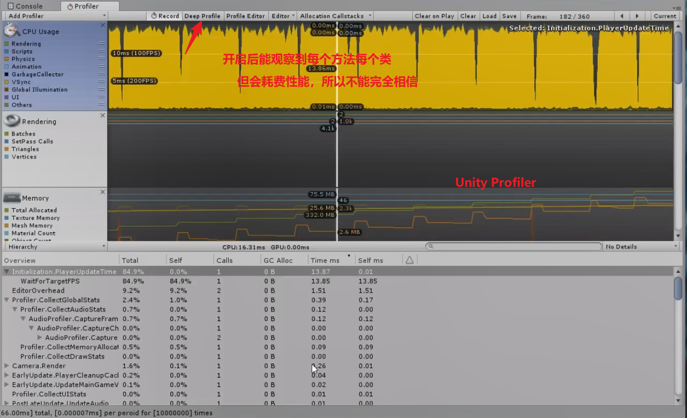

**Custom Profiler**（自定义的Profiler）

```c#
    private void Update()
    {
        CustomProfrile();
    }

    void CustomProfrile()
    {
        UnityEngine.Profiling.Profiler.BeginSample("CustomProfrile");
        for (int i = 0; i < 100; i++)
        {
            CustomFunction();
        }
        UnityEngine.Profiling.Profiler.EndSample();
    }

    private void CustomFunction()
    {
        UnityEngine.Profiling.Profiler.BeginSample("CustomFunction");
        for (int i = 0; i < 100; i++)
        {
            CustomCale();
        }
        UnityEngine.Profiling.Profiler.EndSample();
    }

    private void CustomCale()
    {
        UnityEngine.Profiling.Profiler.BeginSample("CustomCale");
        float t = 100, f = 0f;
        for (int i = 0; i < 100; i++)
        {
            f += Mathf.Pow(Mathf.Sin(i), t);
        }
        UnityEngine.Profiling.Profiler.EndSample();
    }
```

**Timer&Log**

```c#
public class ProTimer :IDisposable
{
    private string name;
   private int times;
   private Stopwatch watch;

    public ProTimer(string name):this(name,0){

    }
    public ProTimer(string name,int times)
    {
        this.name=name;
        this.times=times;
        if(this.times<=0)
            this.times=1;
        watch=Stopwatch.StartNew();
    }

    public void Dispose(){
        watch.Stop();
        float ms=watch.ElapsedMinlliseconds;
        if(times>1){
            Debug.Debug.Log(string.Format("ProTimer : [{0}] finished: [{1:0.00}ms] total, [{2:0.000000}ms] per peroid for [{3}] times"
            ,name ,ms,ms/timer,times));
        }
        else
            Debug.Debug.Log(string.Format("ProTimer : [{0}] finished: [{1:0.00}ms] total",name,ms ));


    }
}
```

##### CPU优化要点

CPU优化要点：Unity脚本最佳做法 数据结构优化 算法优化

**Unity脚本最佳做法**

- Component的缓冲与获取
- **移除空声明**
- 避免Find和SendMessage(大概比直接函数调用慢2000倍)
- 禁止未使用的游戏脚本与对象 （生存周期 可见性 距离）
- 对象池

Component获取的三种方式

- (CompTest)Component("Testcomponent")
- GetComponent<CompTest>();
- (CompTest)GetComponent(typeof(CompTest))

性能消耗

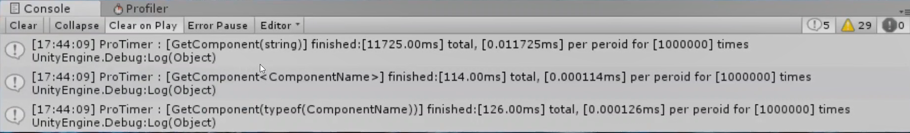

避免Find和SendMessage-替代方案

- 直接引用游戏对象
- 静态类
- 单例组件
- 自定义消息系统

性能分析注意事项

- 分析第一，优化第二
- 分析要透彻，避免一知半解盲目优化
- 避免为性能分析增加过多临时代码
- 增加的日志在头花完成及时移除
- 尽量通过DeBug发现问题

#### 性能优化-GPU

**原理**

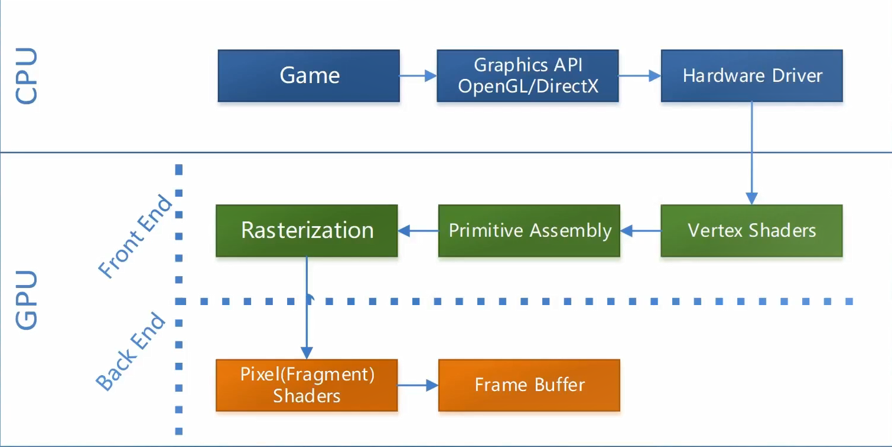

###### **工具**

Unity Profiler Frame Debug GPU Profiler

###### **GPU优化要点**

- Drawcall
- Batching
- 图集
- 移动设备优化

渲染对象关系

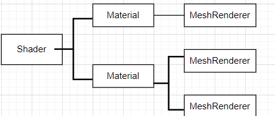

Dynamic Batching

- 所有Mesh实例具有相同的材质引用
- 只有Partucle System和MeshRenderer可以动态批*（随Unity版本不同）
- Vertex Attribute总数必须小于900
- 所有实例必须采用Uniform Scale或所有Mesh都采用Nonuniform Scale，不能混合使用。
- 必须引用相同的LightMap
- 材质Shader不用使用Multiple Passes
- Mesh实例不能接受实时阴影
- 每个Batch最大300Mesh
- 最多32000Mesh可以Batch

Static Batching

- 所有Mesh实例具有相同的材质引用
- 所有Mesh必须标记为Static
- 额外的内存占用
- 静态对象无法通过原始的Transform移动
- 任何一点可见，全部渲染

移动设备优化要点

- 最小的Drawcall
- 最小的材质数量
- 最小的纹理尺寸
- 方形&POT纹理
- Shader中使用尽可能低的数据类型
- 避免Alpha测试

#### 性能优化-内存

###### 内存占用优化

分析工具 **Unity Profiler**

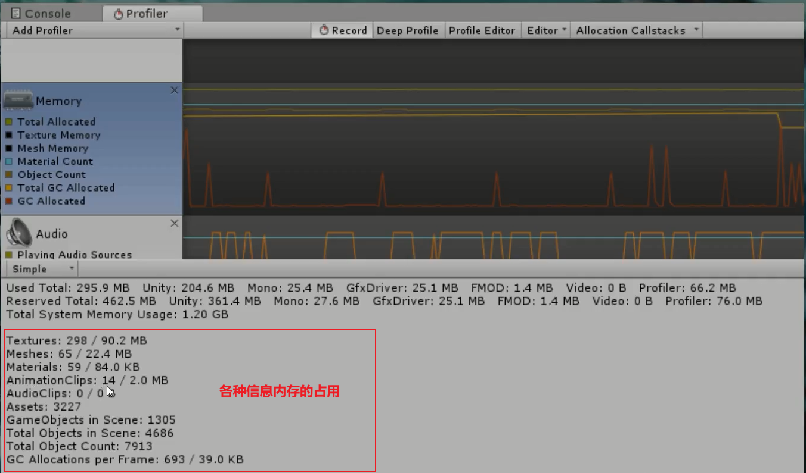

除此之外，unity还有另外一个更加直观的工具

**Memory Profiler** (开源库之中)

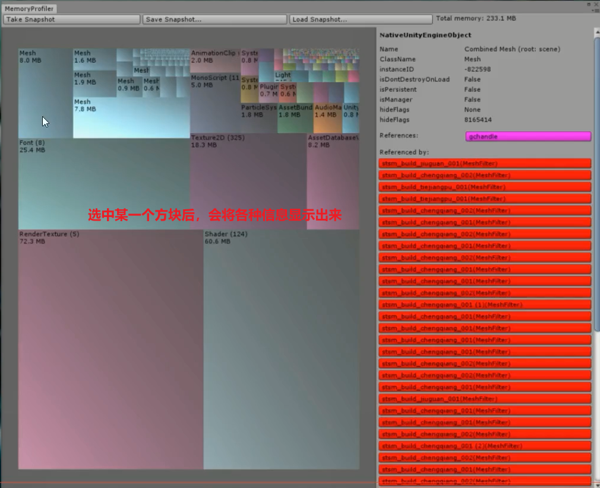

###### **Unity占用组成**

- Unity

- Mono

- GfxDriver(显卡驱动消耗的内存)

- FMOD（音频引擎）

- 细分(Texture Mesh Animation Shader Font)

  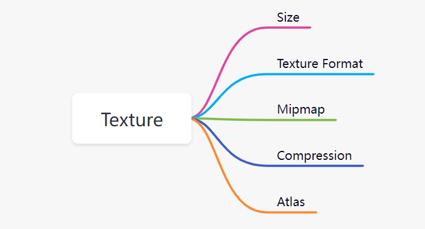

  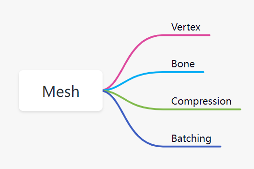

  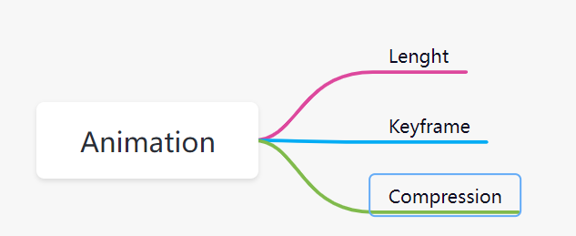

###### GC优化

GC 内存堆栈 垃圾回收

https://zhuanlan.zhihu.com/p/265217138

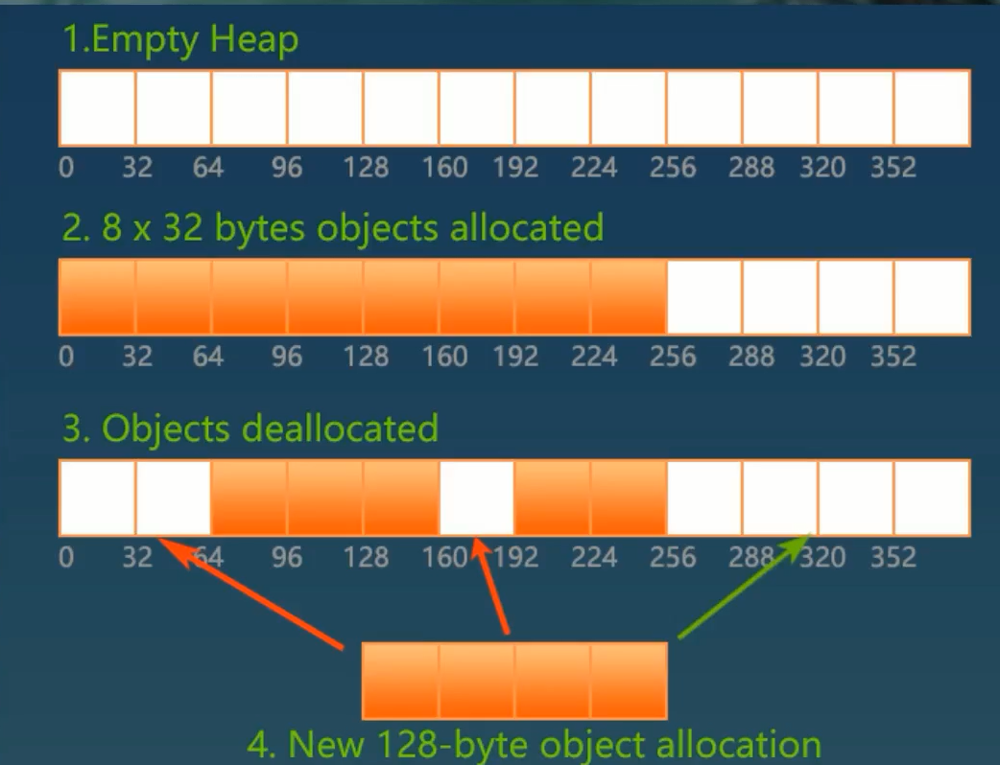

优化要点

- 减少频繁的对象创建
- 避免装箱
- 善用缓存
  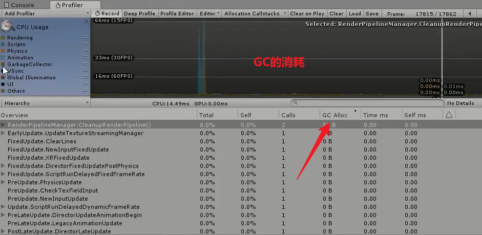
