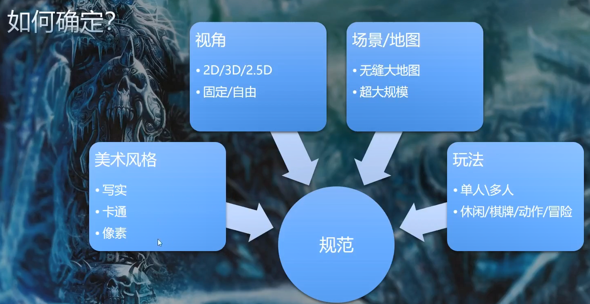
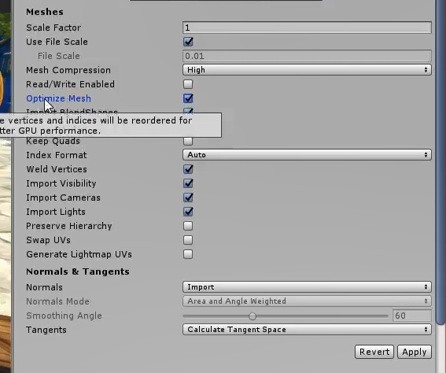
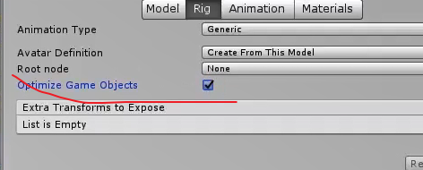

### 资源优化

目标： 一般从两个方面 性能 品质

内存占用 大小/容量 运行效率（帧率高不高）

先考虑资源

基础资源类型

模型 动作 纹理 声音 字体

综合资源类型

场景（地形 光源）UI（图集）粒子系统

**游戏资源的制作规范**

模型：三角形数量 UV LOD

动作：时长 帧率

贴图：尺寸 格式

**模型导入优化**

模型压缩 网格优化 可读写 Lightmap UV

动作导入 动画压缩 Rig-优化游戏对象

纹理格式 POT 纹理大小 压缩选项

**场景优化**

资源的组织 引用及依赖 资源复用

**优化流程自动化**

Unity MeshCompression 网格优化

模型的Optimize GameObject开启后 ，模型的子节点将压缩成一个节点

资源后处理 代码

Unity AssetPostProcessor

https://docs.unity3d.com/2019.2/Documentation/ScriptReference/AssetPostprocessor.OnPreprocessTexture.html

