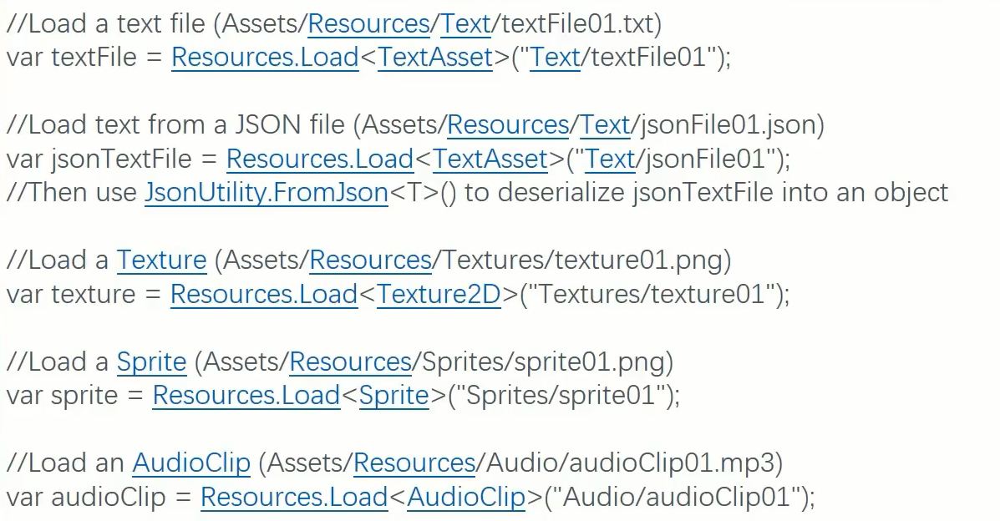
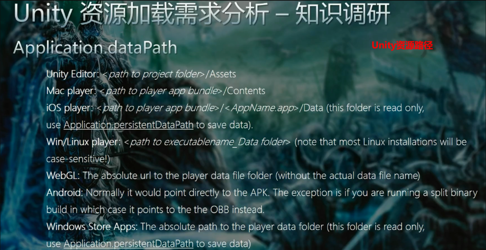
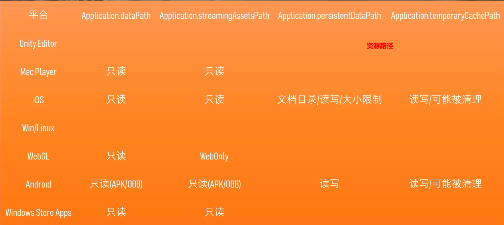
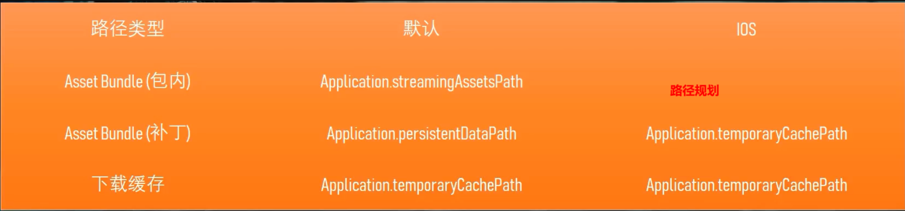
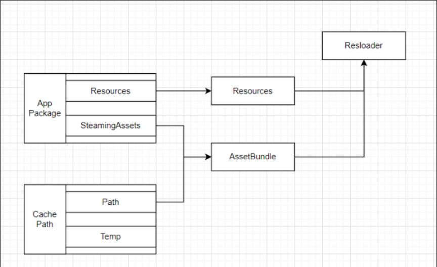
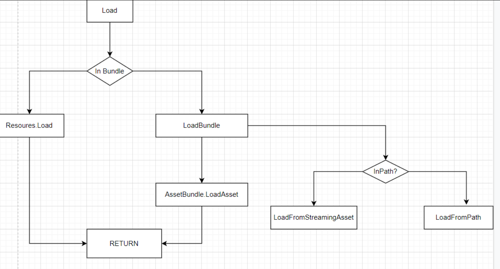
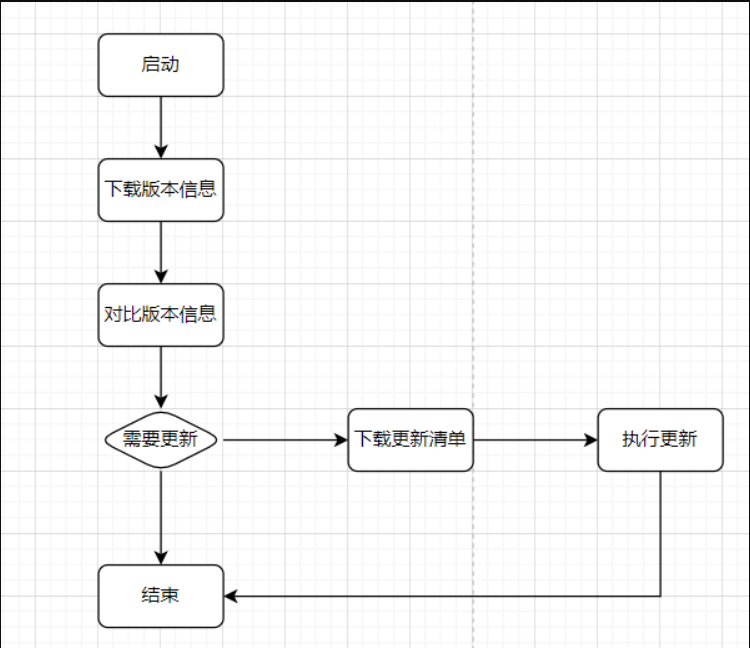

#### 资源类型及加载方式 

1.Resources 直接使用Resource.Load 可以直接加载到资源

2.Asset Bundles 做打包更新必须需要使用的方式

| [AssetBundle.LoadFromMemory](https://docs.unity3d.com/ScriptReference/AssetBundle.LoadFromMemory.html) 从内存加载，多用在需要严谨的等待逻辑执行完，并且中间不做其他事情 |
| ------------------------------------------------------------ |
| [AssetBundle.LoadFromMemoryAsync](https://docs.unity3d.com/ScriptReference/AssetBundle.LoadFromMemoryAsync.html) 从内存区域异步创建 AssetBundle |
| [AssetBundle.LoadFromFile](https://docs.unity3d.com/2018.4/Documentation/ScriptReference/AssetBundle.LoadFromFile.html) 从硬盘上的文件上加载 支持任何压缩类型的包 |
| [AssetBundle.LoadFromFileAsync](https://docs.unity3d.com/2018.4/Documentation/ScriptReference/AssetBundle.LoadFromFileAsync.html) 异步 |
| [AssetBundle.LoadFromStream](https://docs.unity3d.com/2018.4/Documentation/ScriptReference/AssetBundle.LoadFromStream.html) 流的方式 边下载边加载 只要是基于流的数据都能创建Bundle 对于要在网络实时加载 最优选择 |
| [AssetBundle.LoadFromStreamAsync](https://docs.unity3d.com/2018.4/Documentation/ScriptReference/AssetBundle.LoadFromStreamAsync.html) |

3.Raw(Image\Movie) 直接在编辑器或者运行场景中放置的

#### Unity资源加载需求

分析

- 发布平台。每一个发布平台的加载情况都不相同
- 动态更新/流式加载 将运行必须的基础数据放到一个包上 其他内容放到另外一个包上
- 压缩加密
- 自定义数据包

关键因数

 Unity资源路径

#### Unity资源加载模块设计

**流程设计**

#### Unity自动更新

**实现方案**

服务器为主的优点

- 动态生成十几需要更新的版本清单
- 一次更新多个版本
- 动态更新策略（渠道 区域 比例）

缺点

- 机制完善的更新系统，开发成本高

- 服务器压力大，运营成本高

客户端为主优点

- 服务器仅作存储压力小
- 无服务器逻辑，无开发成本

缺点

- 难以支持动态策略，不灵活
- 一次更新到最新成本高
- 适合逐版本增量升级

更新流程

