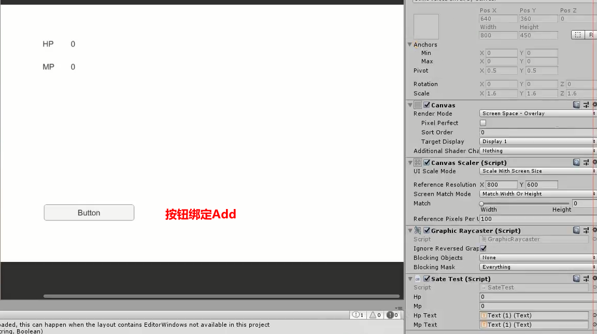
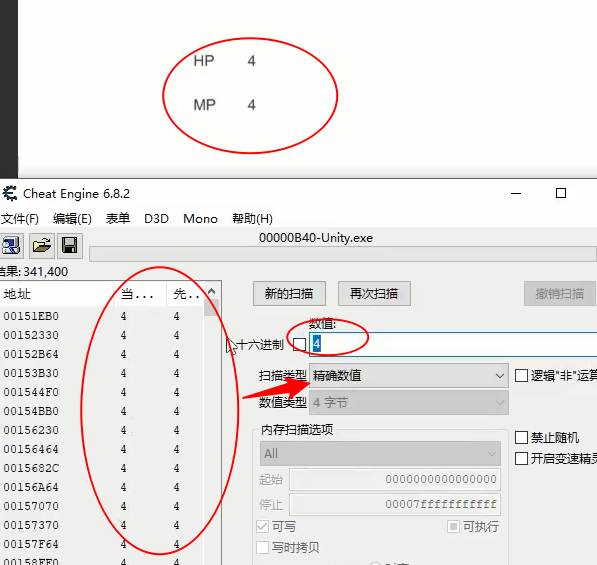
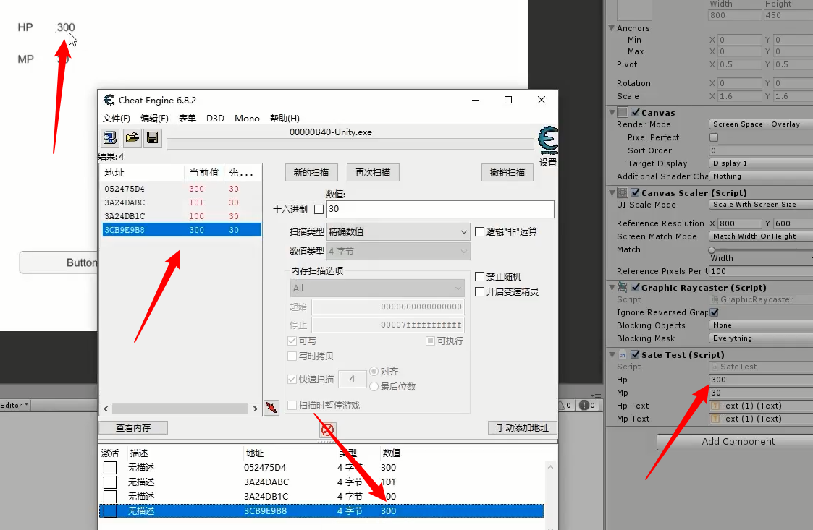
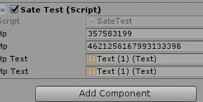

# 游戏安全

### 常见威胁

1.**外挂**

- 加速挂 单机加速，修改本地计算机的时钟周期 网络加速 加快发包速度
- 协议挂 破解通讯协议 模拟游戏行为 功能丰富，支持脱机
- 内存挂 基于Hook（拦截系统对API的调用行为）和注入技术 功能强大
- 脚本辅助 键盘鼠标模拟 不易检测

2.破解

3.数据篡改

- 内存数据
- 存档数据
- 通讯数据

### 游戏安全的基础应对

**通用方案**

- 进程检测：获取电脑后台进程，对常见外挂的进程创建黑名单

- 窗口检测：因为很多外挂都有窗口的特性，对外挂窗口进行关闭

- HOOK检测：自己创建一个Hook，通过对方攻击的手段，修复

  **加密 混淆 加壳**

对数据进行保护 内存及存档

**内存分析工具 WireShark**

**Cheat Engine**



```c#
public class SateTest ：MonoBehaviour
{
    int magic = 0x1110004;
    
    public Text hpText;
    public Text mpText;
    
    public int hp;
    public int HP
    {
        get{ return hp; }
        set{ hp = value; }
    }
    
    public int mp;
    public int MP
    {
        get{ return mp; }
        set{ mp = value; }
    }
    
    public void Add()
    {
    	this.HP += 1;
        this.MP += 1;
    }
    
    void Update()
    {
    	this.hpText.text = HP.ToString(); 
        this.mpText.text = ((int)MP).ToString();
    }
}
```

 开启**Cheat Engine**选择Unity的进程




重复Add操作和数值扫描操作

随后选中一个地址将地址加入到地址列表，然后修改数值 如30改成300



可以看见对进程内存进行修改后 Unity的值也同样修改了。

实现了对内存值的修改。


所以我们应该对进程进行加密，让别人找不到这些地址


**位运算异或**


修改的代码

```
public class SateTest ：MonoBehaviour
{
    int magic = 0x1110004;
    
    public Text hpText;
    public Text mpText;
    
    public int hp;
    public int HP
    {
        get{ return hp ^ magic ; }
        set{ hp = value ^ magic ; }
    }
    
    public Long mp;
    public float MP;
    {
        get{ return (float)System.BitConverter.Int64BitsToDouble(mp ^ magic); }
        set{ mp = System.BitConverter. Int64BitsToDouble(value)^ magic; }
    }
    
    public void Add()
    {
    	this.HP += 1;
        this.MP += 1;
    }
    
    void Update()
    {
    	this.hpText.text = HP.ToString(); 
        this.mpText.text = ((int)MP).ToString();
    }
}
```

一个简单的位运算操作。就会让别人找不到你的数值地址



对于常规的数值修改很有效