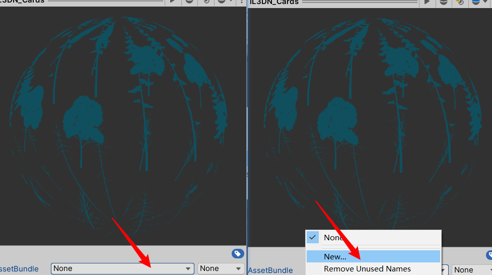
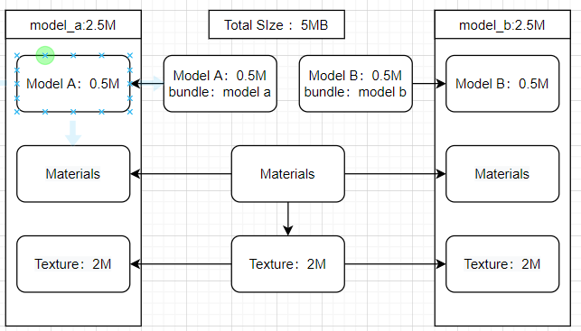
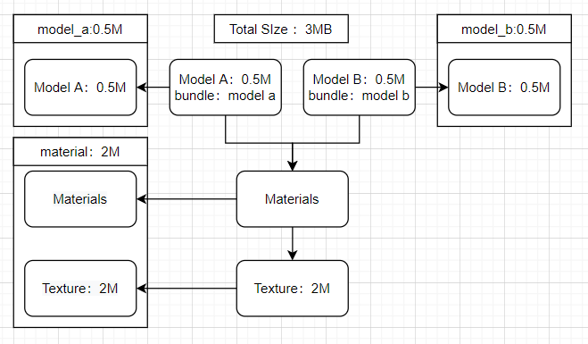
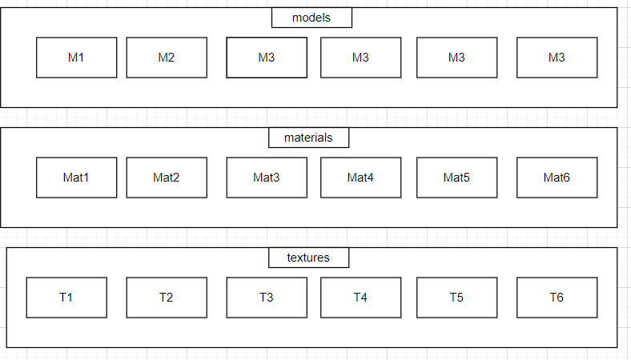
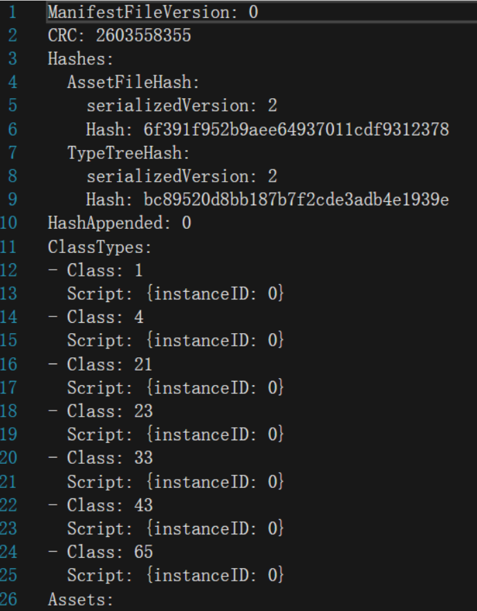
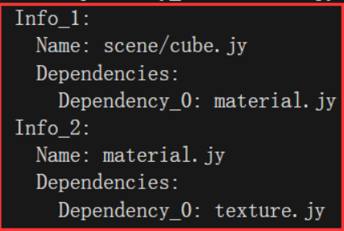
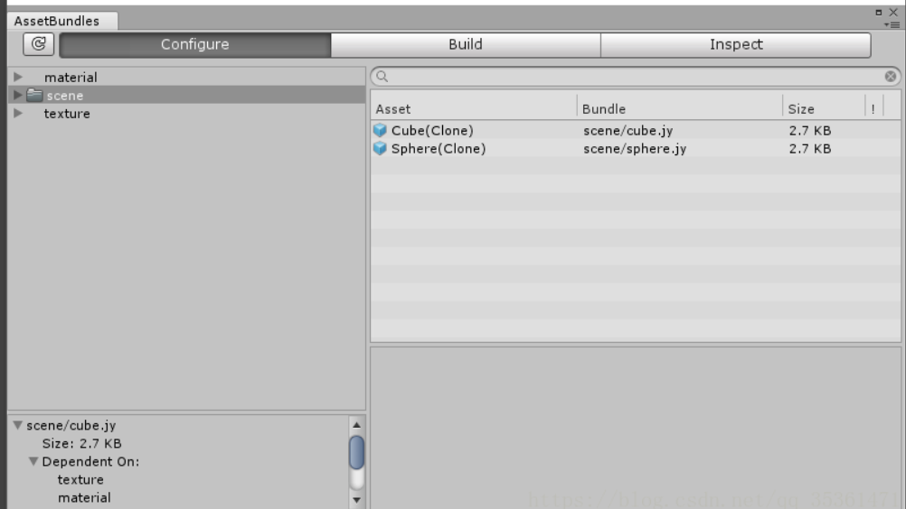
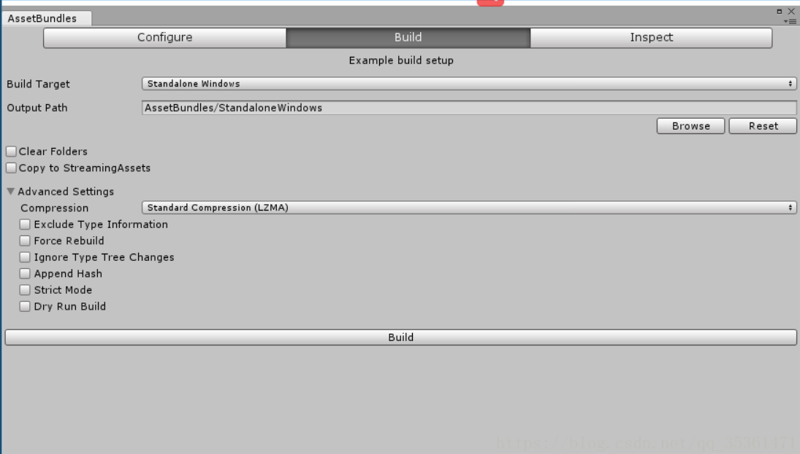

#### AssetBundle的作用

- AssetBundle相当于是一个资源压缩包，里面的一个个对象，对象有两大类 一类是纯资源的对象，另外一个是Unity序列化的一些游戏对象。包含模型、贴图、预制体、声音、甚至整个场景。
- AssetBundle自身保存着互相的依赖关系;
  压缩包可以使用LZMA和LZ4压缩算法，减少包大小，更快的进行网络传输；
- 把一些可以下载内容放在AssetBundle里面，可以减少安装包的大小；
- 版本更新
- 减少运行时的内存压力
- DownLoaddable Content（DLC）

#### AssetBundle的创建

设置 Asset Bundle Name




**Build AssetBundle**

```c#
public class BuildTool 
{
    [MenuItem("BuildTool/Clear AssetBundles")]
    static void ClearAllAssetBundles()
    {
        var allBundles = AssetDatabase.GetAllAssetBundleNames();
        foreach (var bundle in allBundles)
        {
            AssetDatabase.RemoveAssetBundleName(bundle,true);
            Debug.LogFormat("BuildTool:Remove Old Bundle:{0}",bundle);
        }
    }

    [MenuItem("BuildTool/Build AssetBundles")]
    static void BuildAllAssetBundles()
    {
        string assetBundleDirectory = "Assets/AssetBundles";
        if (!Directory.Exists(assetBundleDirectory))
        {
            Directory.CreateDirectory(assetBundleDirectory);
        }
        BuildPipeline.BuildAssetBundles(assetBundleDirectory,BuildAssetBundleOptions.None,BuildTarget.StandaloneWindows64);
    }
}

```

#### AssetBundle的加载

```c#
public class BundleTest : MonoBehaviour
{
    void Start()
    {
        StartCoroutine(LoadCharacter("Test"));
    }

 IEnumerator LoadCharacter(string assetBundleName)
    {
        string uri = "file:///Assets/AssetBundles/Test"+assetBundleName.ToLower()+".asset";
        UnityWebRequest request = UnityWebRequestAssetBundle.GetAssetBundle(uri);
        yield return request.SendWebRequest();
        AssetBundle bundle = DownloadHandlerAssetBundle.GetContent(request);
        GameObject gameObject=bundle.LoadAsset<GameObject>(assetBundleName);
        Instantiate(gameObject); 
    }
}
```

AB加载方式：

1. AssetBundle.LoadFromFile 从本地加载

2. AssetBundle.LoadFromMemory 从内存加载

3. WWW.LoadFromCacheOrDownload 下载后放在缓存中备用(该方法逐渐被弃用)

4. UnityWebRequest 从服务器下载

从AB中加载资源：

1. AssetBundle.LoadAsset(assetName)

2. AssetBundle.LoadAllAssets() 加载AB包中所有的对象，不包含依赖的包

3. AssetBundle.LoadAssetAsync() 异步加载，加载较大资源的时候

4. AssetBundle.LoadAllAssetsAsync() 异步加载全部资源

5. AssetBundle.LoadAssetWithSubAssets 加载资源及其子资源

AB的卸载

1. 减少内存的使用
2. 有可能导致丢失
3. 在切换场景，或者确定不使用的时候卸载
   AssetBundle.Unload(true) //卸载AB文件的内存镜像，且包含所有Load创建出来的对象
   AssetBundle.Unload(false) //卸载AB文件的内存镜像，但是除了Load创建出来的对象
   Reources.UnloadAsset(Object) //释放已加载的资源Object
   Resources.UnloadUnusedAssets //卸载所有没有被场景引用的资源对象


#### AssetBundle的进阶

##### AssetBundle依赖关系

1.打包依赖



**原本只需要3M的内存，而打包后会发生冗余。**


**优化，将共享的资源单独打包一个Bundle**



同时也要记得在加载Bundle的时候加上加载材质Bundle的代码


```c#
public class BundleTest : MonoBehaviour
{
    void Start()
    {
        StartCoroutine(LoadCharacter("Test"));
    }

 IEnumerator LoadCharacter(string assetBundleName)
    {
    	//Bundle 1
        string uri = "file:///Assets/AssetBundles/Test"+assetBundleName.ToLower()+".asset";
        UnityWebRequest request = UnityWebRequestAssetBundle.GetAssetBundle(uri);
        yield return request.SendWebRequest();
        AssetBundle bundle = DownloadHandlerAssetBundle.GetContent(request);
        
        //Bundle 2
        string uri2 = "file:///Assets/AssetBundles/Test/Test.mat.asset";
        UnityWebRequest request2 = UnityWebRequestAssetBundle.GetAssetBundle(uri2);
        yield return request2.SendWebRequest();
        AssetBundle bundle2 = DownloadHandlerAssetBundle.GetContent(request2);
        
        GameObject gameObject=bundle.LoadAsset<GameObject>(assetBundleName);
        Instantiate(gameObject); 
    }
}
```


2.加载依赖




这种方式加载，会出现一个问题就是，加载一个model时要加载Bundle里所有的M 加载一个纹理也要加载包里所有的material 贴图也是，出现了资源冗余，那我们就需要一个好的分配

##### 分配策略

**1.按类型分组**

- 强类型关联，将相同的资源打包在一个Bundle
- 平台相关，将不同平台下的资源分别打包
- 本地化相关
- 无交叉依赖 不会对另外一个Bundle产生依赖
- 所有声音资源打成一个包，所有shader打成一个包，所有模型打成一个包，所有材质打成一个包

**2.按并发分组**

- 加载时机一致，在很短的时间内同时发生的资源都打包到一个Bundle
- 无交叉依赖

**3.按逻辑单元分组**

- 逻辑功能 如UI资源 相对独立
- 逻辑对象 一个角色或者所有角色一个包
- 共享对象 所有的场景所共享的部分一个包

#### **其他建议**

- 对频繁更新的对象进行拆分
- 同时加载的对象打包到一起
- 拆分加载时机不一致的Bundle
- 合并频繁加载的小粒度Bundle

#### Manifest文件




crc为校验码，通过其检查是否完整

Assets 表示包里包含多少资源

Dependencies 表示包有哪些依赖

注意：在加载这些包之前，也需要加载依赖的包，不然会丢失这部分内容，显示效果不正确


#### 通过Manifest文件得到某个包的依赖




可以注意到scene/cube.jy依赖于material.jy，而material.jy依赖于texture.jy

```c#
AssetBundle manifestAB = AssetBundle.LoadFromFile("AssetBundles/AssetBundles");
AssetBundleManifest manifest = manifestAB.LoadAsset<AssetBundleManifest>("AssetBundleManifest");
//GetAllDependencies获取到所有的依赖对象
string[] strs = manifest.GetAllDependencies("scene/cube.jy");
//将所有依赖对象依次加载出来
foreach (var item in strs)
{
    Debug.Log(item);  
    AssetBundle.LoadFromFile("AssetBundles/" + item);
}

```

CRC、MD5、SHA1都是通过对数据进行计算，来生成一个校验值，该校验值用来校验数据的完整性。

CRC一般用于通信数据的校验，MD5和SHA1用于安全领域，例如文件校验，密码加密等


#### AssetBundles浏览工具

[工具地址](https://github.com/Unity-Technologies/AssetBundles-Browser)







Build Target 用于设置AB包的目标平台

OutPut Path 设置AB的输出路径

Build 一键打包

