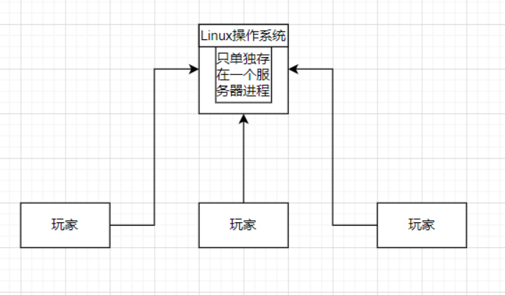
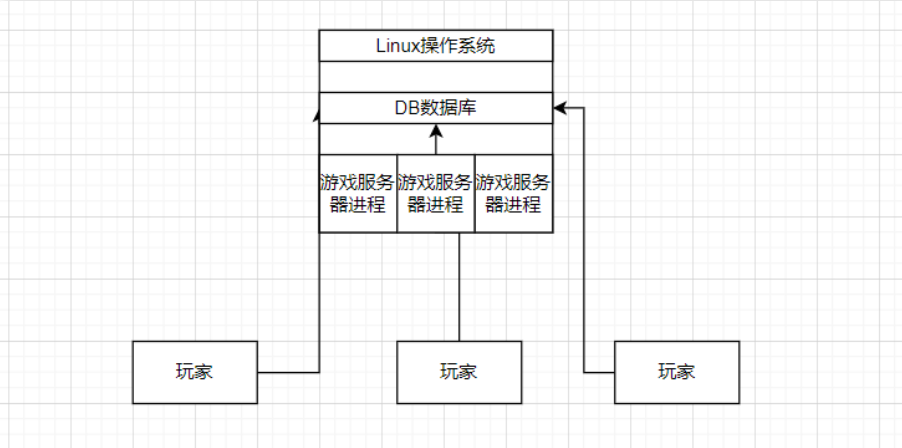
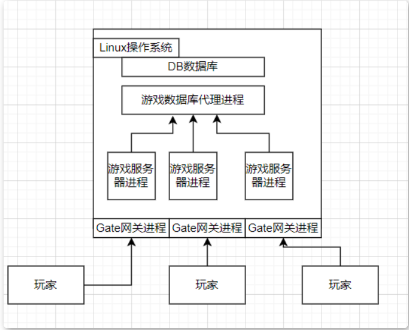
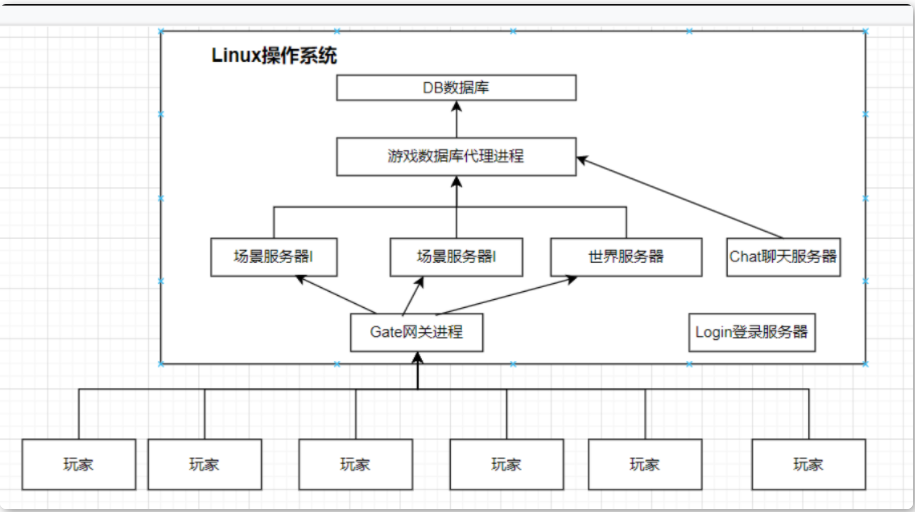

### 游戏服务器架构

**第一代游戏服务器架构**

使用单台物理机，单个游戏服务器程序进程 单线程无阻塞Socket来服务所有的玩家，，每隔一秒与玩家进行更新同步数据

处理的速度是非常非常低的，且因为当时没有数据库，数据是存在本地的，要对本地数据进行IO读写

**第二代游戏服务器架构**

采用分区分服模式，同时引入数据库软件存储游戏数据，用于存储游戏数据，多个游戏服务器进程同时运行，每个游戏服务器都是独立的

**第三代游戏服务器架构 (三层架构)**

发展处让玩家统一连接的网关服务器，而数据库存储的任务则交由数据库代理服务器进程处理，游戏服务器进程专心处理游戏功能业务逻辑

玩家发出的请求交给Gate网关 网关转发给服务器进程。 因为之前玩家是直接连接游戏服务器进程，那么服务器进程就要管理大量的Socket连接 还要对不同的Socket进程进行IO读写，效率慢，所以我们将与网络连接的功能单独提取出来交给Gate网关进行处理

**第三代游戏服务器架构 (无缝地图)**

玩家可以在不同的地图之间 进行无缝地图传送 大型MMORPG的标准配置