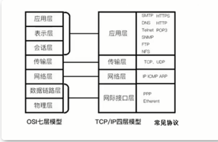
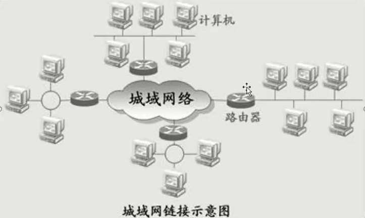
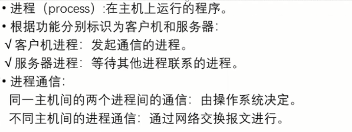
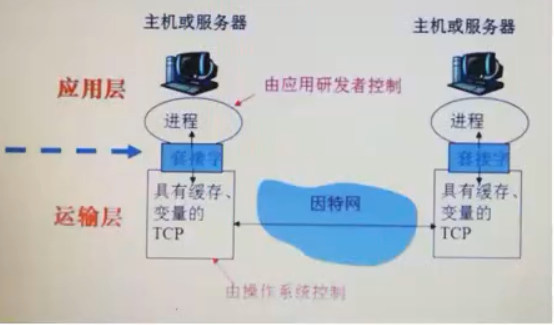

# 计算机网络基础

## OSI TCP UDP



OSI七层协议除了最高层，下面每一层都给上面一层提供服务。

TCP面向连接（如打电话要先拨号建立连接）；UDP是无连接的既发送数据之前不需要建立连接

TCP提供可靠的服务。也就是说，通过TCP连接传送的数据，无差错，不丢失，不重复，且按序到达；UDP尽最大努力交付，既不保证可靠交付。（QQ和微信通话就是UDP，因为不需要保证可靠的交付，服务器是TCP，因为要保证客户数据无差错的 不丢失的）

TCP面向 字节流，实际上是TCP把数据看成一连串无结构的字节流；UDP是面向报文

每一条TCP连接只能是点到点的；UDP支持一对一，一对多，多对一和多对多的交互通信

## IP 端口号

主机是有一个IP地址的，主机与主机之间想要互相通信，联系的话，就需要通过IP地址，服务器要给客户端发送一个消息的话，服务器如果想要识别到客户端在我们主机上的哪一个位置的话，就需要用到端口号 端口号相当于人的姓名一样。



应用层-套接字Socket

应用程序和网络之间的应用程序接口API，是在网络是建立网络应用程序的可编程接口

应用层-进程



进程类似房子 套接字是进程的门 

进程通过套接字在网络上发送和接收报文

发送进程；把报文退出门（套接字）

传送报文；通过下面网络把报文传送到目的进程门口

接收进程：通过门（套接字）接收报文



Socket编程

服务端

```c#
using System;
using System.Net;
using System.Net.Sockets;
using System.Text;
using System.Threading;
using System.Threading.Tasks;

namespace SocketServerTest
{
    class Program
    {
        static Socket serverSocket;
        static void Main(string[] args)
        {
            serverSocket = new Socket(AddressFamily.InterNetwork, SocketType.Stream, ProtocolType.Tcp);

            //绑定端口和ip 端口在0-65535之间
            serverSocket.Bind(new IPEndPoint(IPAddress.Parse("127.0.0.1"), 6666));
            serverSocket.Listen(10);
            Console.WriteLine("服务器启动成功");
            Thread thread = new Thread(AcceptClient);
            //启动
            thread.Start();

            Console.ReadKey();
        }

        private static void AcceptClient()
        {
            Socket clientSocket = serverSocket.Accept();
            byte[] data = Encoding.Default.GetBytes("服务器告诉你连接成功了");
            clientSocket.Send(data);
            //生成方法
            Thread thread = new Thread(ReveiveMsg);
            thread.Start(clientSocket);
        }

        private static void ReveiveMsg(object clientSocket)
        {
            byte[] data = new byte[1024];
            int length = (clientSocket as Socket).Receive(data);
            Console.WriteLine(Encoding.Default.GetString(data, 0, length));
        }
    }
}
```

客户端

```c#
using System;
using System.Net;
using System.Net.Sockets;
using System.Text;
using System.Threading;

namespace SocketClientTest
{
    class Program
    {
        private static Socket clientScoket;
        static void Main(string[] args)
        {
            clientScoket = new Socket(AddressFamily.InterNetwork, SocketType.Stream, ProtocolType.Tcp);
            clientScoket.Connect(new IPEndPoint(IPAddress.Parse("127.0.0.1"), 6666));
            Console.WriteLine("与服务器建立了连接");
            clientScoket.Send(Encoding.Default.GetBytes("客户端发送的一条消息"));
            Thread thread = new Thread(Receive);
            thread.Start();

            Console.ReadKey();
        }

        private static void Receive()
        {
            byte[] data = new byte[1024];
            int length = clientScoket.Receive(data);
            Console.WriteLine(Encoding.Default.GetString(data, 0, length));
        }
    }
}

```

